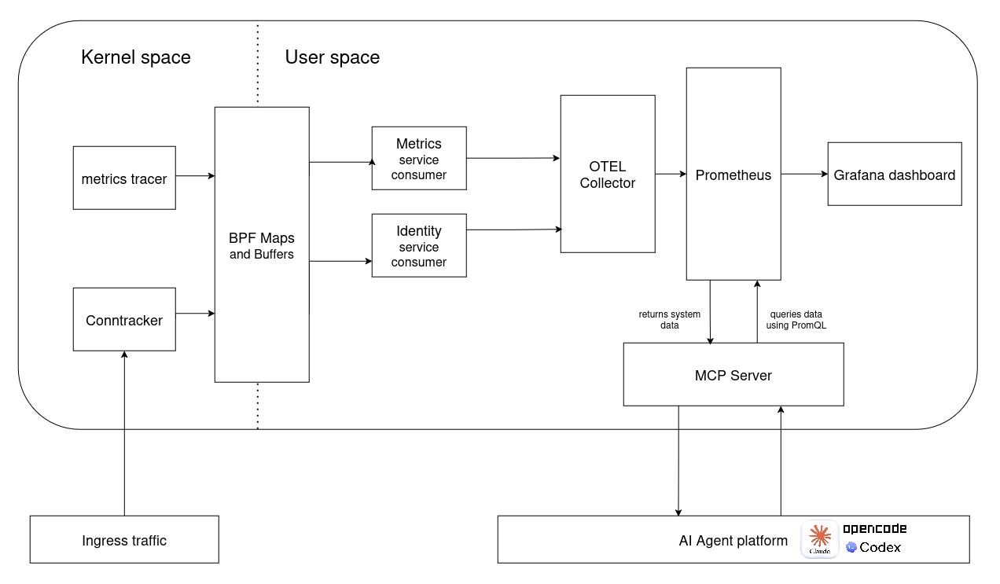
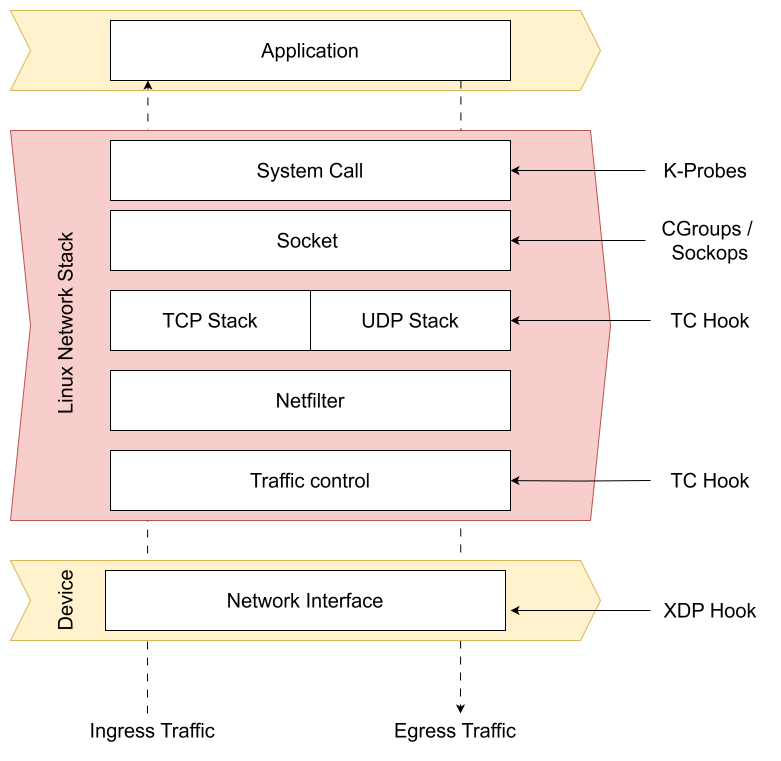

# Architecture Overview

This page describes the CortexBrain architecture with a focus on how data flows from the Linux kernel, through eBPF programs and pinned BPF maps, to the user-space gRPC agent, and finally to the `cfcli` and the Grafana Dashboard.

The conceptual diagram on the [home page](../index.md#architecture) gives the high-level picture; in this page you will find the full detailed pipeline.

## Architecture Resume

CortexBrain is built around a four-stage pipeline. Each stage has a clear responsibility and a well-defined boundary with the next.

| Stage | Components | Role | Output |
|-------|------------|------|--------|
| **1. Kernel instrumentation** | `conntracker`, `metrics_tracer` (eBPF) | Observe at kernel level via TC classifiers and kprobes | PerfEventArray fills |
| **2. Map pinning** | `identity`, `metrics` (user-space loaders) | Load + attach the eBPF programs, pin the maps to `/sys/fs/bpf/`, seed policy | Pinned maps in bpffs |
| **3. Aggregation & serving** | `agent` (`core/api`) - gRPC on `:9090` and opentelemetry collector on `:4317` | Open pinned maps, drain perf buffers into mpsc channels, serve the RPC and aggregate the data for visualization | gRPC responses |
| **4. Consumption** | `cfcli` (live), `prometheus` ,`dashboard` (grafana) | Forwards the data to the UI components |

!!! tip "Reading order"
    If you want the detail behind each stage, after this page read the [Agent API Overview](agent-api.md) for the gRPC surface and the [Integrated Metrics](metrics.md) page for the metric field schemas.

## Full Pipeline 
!!! warn
    The **0.1.5** version adds OpenTelemetry instruments across socket/network, CPU, memory, scheduler, and SSL tracing (experimental) see the [Integrated Metrics](metrics.md#opentelemetry-metrics-incoming-metrics-patch) page for the full instrument list.

### Kernel hooks

CortexBrain attaches eBPF programs to the following kernel hook points. The diagram below shows where these hooks sit in the Linux network stack.

| Program | Attach type | Target function | BPF map written | Data produced |
|---------|-------------|-----------------|------------------|---------------|
| `identity_classifier` | TC classifier (ingress) | veth interfaces | `EventsMap` | `PacketLog` (per-packet metadata) |
| `veth_creation_trace` | kprobe | `register_netdevice` | `veth_identity_map` | `VethLog` (event_type=1) |
| `veth_deletion_trace` | kprobe | `unregister_netdevice_queue` | `veth_identity_map` | `VethLog` (event_type=2) |
| `tcp_message_tracer` | kprobe | `tcp_v4_rcv`, `tcp_v4_connect` | `TcpPacketRegistry` | `TcpPacketRegistry` (TCP flow metadata) |
| `metrics_tracer` | kprobe | `tcp_identify_packet_loss` | `net_metrics` | `NetworkMetrics` (socket stats + drops) |
| `tcp_connect` | kprobe | `tcp_v4_connect`, `tcp_v6_connect` | `time_stamp_start` | start timestamp keyed by socket pointer |
| `tcp_rcv_state_process` | kprobe | `tcp_rcv_state_process` | `time_stamp_events` | `TimeStampEvent` (latency `delta_us`) |

**Source files**:
- `core/src/components/conntracker/src/main.rs` and sub-modules (`tc.rs`, `veth_tracer.rs`, `tcp_analyzer.rs`, `data_structures.rs`)
- `core/src/components/metrics_tracer/src/main.rs` and `data_structures.rs`

### Deployment topology

All CortexBrain components run in the `cortexflow` namespace. The core deployments use `hostPID: true`, `hostNetwork: true`, and `privileged: true` with the `BPF`, `SYS_ADMIN`, `NET_ADMIN`, `SYS_PTRACE`, and `SYS_RESOURCE` capabilities, and mount the host `/sys/fs/bpf` (bidirectional), `/proc`, and `/lib/modules`.

| Pod (Deployment) | Container & binary | Image | Network exposure | BPF maps (producer / consumer) |
|------------------|--------------------|-------|------------------|--------------------------------|
| `cortexflow-agent` | `agent` -> `/usr/local/bin/agent-api` | `lorenzotettamanti/cortexflow-agent:latest` | Service `cortexflow-agent` ClusterIP TCP 9090 (grpc); reached by `cfcli` via `kubectl port-forward` | **Consumer only** - reads `events_map`, `net_metrics`, `time_stamp_events`, `blocklist_map` |
| `cortexflow-identity` | initContainer `bpf-map-permissions` (mounts bpffs); `identity` -> `/usr/local/bin/cortexflow-identity-service`; sidecar `bpftool-control-manager` | `lorenzotettamanti/cortexflow-identity:latest` | None (no Service) | **Producer** - pins `events_map`, `veth_map`, `blocklist_map`, `tcp_packet_registry`; seeds `blocklist_map` from the `cortexbrain-client-config` ConfigMap |
| `cortexflow-metrics` | `metrics` -> `/usr/local/bin/cortexflow-metrics`; sidecar `bpftool-control-manager` | `lorenzotettamanti/cortexflow-metrics:latest` | None (no Service) | **Producer** - pins `net_metrics`, `time_stamp_events` |

**Manifests**: `core/src/testing/agent.yaml`, `core/src/testing/identity.yaml`, `core/src/testing/metrics.yaml`
## Where to go next

- **[Agent API Overview](../developer-guide/agent-api.md)** - the gRPC RPCs and the BPF maps behind them, in detail.
- **[Integrated Metrics](../developer-guide/metrics.md)** - the field schemas for `ConnectionEvent`, `LatencyMetric`, `DroppedPacketMetric`, and the incoming OpenTelemetry instruments.
- **[Development Workflow](../developer-guide/development-workflow.md)** - how to build the components locally and submit changes.
- **[Development Goals & Discussions](../developer-guide/discussions.md)** - milestones, roadmap, and how to propose new features.