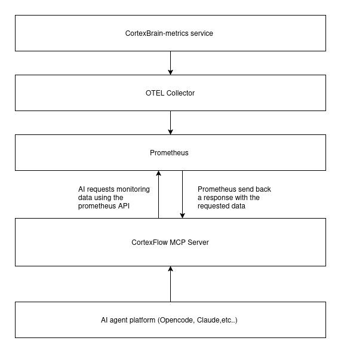

# MCP Server (Experimental)

CortexBrain ships a **Model Context Protocol (MCP) server** that exposes its eBPF-derived metrics to AI assistants (opencode, Claude Desktop, etc.) so they can query the cluster state in natural language. The server is a thin stdio JSON-RPC process that translates tool calls into PromQL queries against a local Prometheus.

## What is the Model Context Protocol?

The [Model Context Protocol](https://modelcontextprotocol.io/) is an open standard (originated by Anthropic) for exposing **tools**, **resources**, and **prompts** to LLM-based assistants over a standard JSON-RPC transport. An MCP host (opencode, Claude Desktop, Cursor) spawns an MCP server as a local child process and calls its tools when the model needs to interact with an external system. CortexBrain uses MCP to let an assistant query Prometheus metrics collected from eBPF.

## Architecture



The MCP server is a **local standalone binary**, not a Kubernetes workload and not a sidecar. The operator builds it and configures an MCP host to spawn it; the host owns the process lifecycle.

## The tools
Metrics are exposed as tools that your AI agent can call. It's also possible to use it in **agentic-workflows**. All the tools share the same input schema:

```json
{
  "type": "object",
  "properties": {
    "container_name": { "type": "string" },
    "timeframe":       { "type": "string" }
  },
  "required": ["container_name", "timeframe"]
}
```

- `container_name` - a string matched against the Prometheus `container_name` label (e.g. `"grafana"`). Note that **container_name** refers directly to the container image used, this is a semantic inefficiency that will be fixed in future 
- `timeframe` - a PromQL range-vector duration (e.g. `"10m"`).

Each tool runs a `sum by(container_name) (rate(...[timeframe]))` query and returns the Prometheus JSON response as a pretty-printed string.

!!! note
    CortexFlow MCP is in its early stages and doesn't have full access to the full [metrics](./metrics.md). If you are willing to make any tests please refer to [contact](../contacts/contact.md) page


| Tool name | Description | PromQL metric | OTel instrument family |
|-----------|-------------|----------------|------------------------|
| `get_cpu_bytes` | CPU bytes allocation per event | `cortexbrain_cpu_bytes_alloc` | gauge |
| `get_memory_allocated_bytes` | Bytes requested via `mmap` syscalls | `cortexbrain_enter_mem_alloc` | gauge |
| `get_events` | Total eBPF events processed across all perf buffers | `cortexbrain_events_total` | counter |
| `get_l4_events` | Total socket state events processed | `cortexbrain_socket_events_total` | counter |
| `get_ssl_write_events` | Total bytes requested by `ssl_write` | `cortexbrain_ssl_write_bytes` | gauge |
| `get_ssl_read_events` | Total bytes requested by `ssl_read` | `cortexbrain_ssl_read_bytes` | gauge |

The `cortexbrain_` prefix comes from the OTLP collector's Prometheus exporter `namespace: cortexbrain` setting (see `Examples/run-with-docker/otel-collector-config.yaml`). The base instrument names (`cpu_bytes_alloc`, `events_total`, ...) are defined in `core/common/src/semantic.rs` on the `metrics-patch` branch.

## Configuration in opencode

The MCP server is configured in `~/.config/opencode/opencode.jsonc` (or the project-local `.opencode/opencode.jsonc`):

```jsonc
{
  "mcp": {
    "cortexflow-mcp": {
      "type": "local",
      "command": ["/home/<user>/CortexBrain/mcp/target/release/mcp"],
      "enabled": true
    }
  }
}
```

- `"type": "local"` + the `command` array tells opencode to spawn the binary as a child process and speak MCP over its stdin/stdout.
- `"enabled": true` auto-starts the server when opencode launches.
- The `"environment"` block (commented out in the example) can inject env vars into the child process - currently unused because the Prometheus URL is hardcoded.

When the assistant needs a metric, opencode sends a `tools/call` request with the tool name and arguments; the server runs the PromQL and returns the JSON result as `TextContent`.

## Building the server

From the repository root (the `mcp/` crate must be checked out - it is on `origin/0.1.5` and `origin/metrics-patch`):

```bash
cargo build --release -p mcp
```

## See also

- [Architecture Overview](architecture.md) - the four-stage pipeline and where Prometheus sits.
- [Integrated Metrics](metrics.md) - the OpenTelemetry instruments that feed Prometheus.
- [Agent API Overview](agent-api.md) - the gRPC service the MCP server currently does *not* call (planned for the roadmap).
- [Security](security.md) - the plaintext Prometheus connection and the hardening roadmap.
- [Troubleshooting](troubleshooting.md) - "MCP server cannot reach Prometheus".