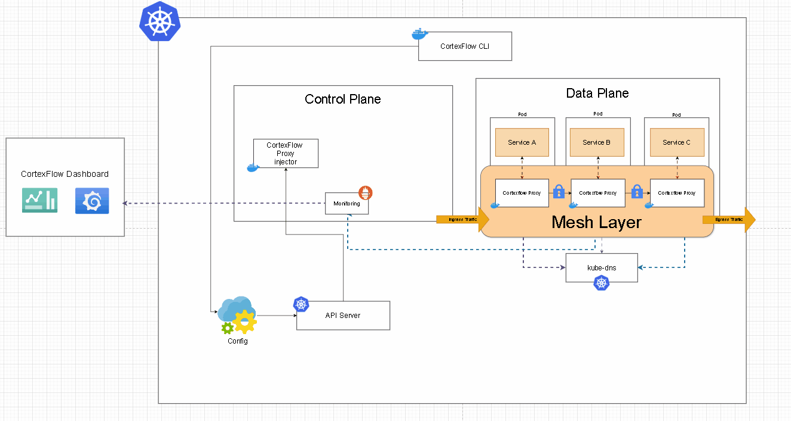

!!! note 
    CortexBrain is currently in active development, so occasional bugs may occur. Your contributions and feedback are invaluable in refining and enhancing the project! 🚀  

**CortexBrain** is an ambitious open-source project aimed at creating an intelligent, lightweight, and efficient architecture to seamlessly connect cloud and edge devices.  

## Current Development Stage

You can see the development stage of every component here:

| **Component**       | **Stage**                | **Latest Commit** | **Referring Branch**  |
|---------------------|--------------------------|-------------------|-----------------------|
| **Dashboard**       | Under development  |                 | `feature/frontend`    |
| **Client**          |  Under development  |                  | `feature/core`        |
| **Proxy**           |  Under development  |                  | `feature/core`        |
| **Controller**      |  Under development  |                  | `feature/core`        |
| **CLI**             | ❌ Not started yet       | ❌                | `feature/cli`         |
| **Identity Service**             | ❌ Not started yet       | ❌                | ❌         |

## An Introduction to Service Mesh

A **service mesh** is a specialized infrastructure layer embedded within a software application that manages communication between services. It handles critical functions such as traffic routing, security, observability, and resiliency, while shielding individual services from these complexities.

In modern applications, functionality is often divided into a network of specialized services, each performing a specific task. To fulfill its role, a service may need to request data from multiple other services. However, issues arise when certain services, like a retailer’s inventory database, become overwhelmed with requests. This is where a service mesh proves invaluable—it orchestrates and optimizes communication between services, ensuring all components work seamlessly together.
## Architecture

The Cortexflow architecture is designed to ensure a robust, scalable, and fault-tolerant system that can operate seamlessly without interruptions. It is composed of several key components that work together to provide a continuous and reliable infrastructure. These components are orchestrated within a Kubernetes cluster, ensuring efficient resource management, high availability, and scalability. Below is a GIF that visually represents the architecture and illustrates how the components interact within the cluster.

The architecture is divided into two main planes: the **Control Plane** and the **Data Plane**. The Control Plane is responsible for managing and orchestrating the system, while the Data Plane handles the actual data processing and traffic routing. This separation of concerns allows Cortexflow to maintain a high level of performance and reliability.

---

# Control Plane

The **Control Plane** is the core of the Cortexflow architecture. It is responsible for managing the overall system, including service discovery, configuration management, and monitoring. The Control Plane consists of a collection of services that run within a dedicated Kubernetes namespace named `cortexflow`. These services work together to ensure the system operates smoothly and can dynamically adapt to changes in the environment.

### Key Components of the Control Plane:

1. **Proxy Injector**:  
   The Proxy Injector is a Kubernetes admission controller that plays a critical role in the Cortexflow architecture. It listens for webhook requests triggered whenever a new pod is created in the cluster. Upon receiving a request, the Proxy Injector automatically injects a sidecar proxy into the pod. This proxy is responsible for handling network traffic, enforcing security policies, and collecting metrics. The injection process is seamless and ensures that all pods within the cluster are automatically equipped with the necessary components to integrate with Cortexflow.

2. **Monitoring System**:  
   Cortexflow leverages **Prometheus** as its primary monitoring system. Prometheus is a powerful open-source tool designed for real-time monitoring and alerting. It collects and stores time-series data, enabling Cortexflow to capture a wide range of metrics that are critical for system health and performance.  

   Prometheus is configured to scrape metrics from various components within the cluster, including the injected proxies, Kubernetes nodes, and other services. These metrics are then made available for querying and visualization. By exposing the `9090` TCP port, users can directly access Prometheus to query metrics using its built-in query language (PromQL). Additionally, Cortexflow provides a user-friendly dashboard that aggregates and visualizes these metrics, making it easier for users to monitor the system's health and performance.

#### Detected Metrics:  
!!! note  
    The list of detected metrics is currently limited, but the Cortexflow team is actively working on expanding the monitoring capabilities to include additional metrics and features. This will provide users with even greater visibility into the system's performance and health.
Currently, Cortexflow collects a limited set of metrics, but the team is actively working on expanding the monitoring capabilities to include more features and metrics. Below is the list of metrics currently being collected:  

1. **Total DNS Requests**:  
    This metric measures the total number of DNS requests that the proxy is handling. It provides insights into the DNS query load and helps identify potential bottlenecks or anomalies in DNS resolution.

2. **DNS Response Time**:  
    This metric tracks the time taken for DNS queries to be resolved. It is a critical indicator of the performance of the DNS resolution process and helps ensure that the system is meeting its latency requirements.

The Cortexflow architecture is designed to be modular and extensible, allowing new components and features to be added as the system evolves. By leveraging Kubernetes and modern monitoring tools like Prometheus, Cortexflow ensures that the system remains resilient, scalable, and easy to manage. This architecture provides a solid foundation for building and deploying distributed systems that can handle high traffic loads while maintaining high availability and performance.

---

# Data Plane

The **Data Plane** is the backbone of the Cortexflow service mesh, responsible for handling all traffic between services. It ensures secure, reliable, and efficient communication across the cluster. When a service needs to communicate with another service, the **sidecar proxy** plays a critical role in managing the interaction. Here's a detailed breakdown of how the Data Plane operates:

1. **Request Interception**:  
   The sidecar proxy intercepts all outgoing requests from the service. This interception happens transparently, without requiring any changes to the application code.

2. **Request Encapsulation**:  
   Once intercepted, the request is encapsulated into a separate network connection. This encapsulation ensures that the communication is isolated and secure.

3. **Secure Channel Establishment**:  
   The sidecar proxy establishes a secure, encrypted channel (e.g., using mTLS - mutual Transport Layer Security) between the source and destination proxies. This ensures that all communication is protected from eavesdropping or tampering.

!!! note
    At the moment of publishing this documentation we are working on the implementation of the security feature

### Key Responsibilities of the Data Plane

- **Low-Level Messaging**:  
  Sidecar proxies handle all low-level communication between services, abstracting away the complexity from the application.

- **Resiliency Features**:  
  The Data Plane implements advanced features such as **circuit breaking** and **request retries** to improve system resiliency. These features prevent cascading failures and ensure graceful degradation during high load or service failures.

- **Service Mesh Features**:  
  The Data Plane is responsible for implementing core service mesh functionalities, including:
  - **Load Balancing**: Distributing traffic evenly across service instances to optimize resource utilization.
  - **Service Discovery**: Automatically detecting and connecting to available services within the cluster.
  - **Traffic Routing**: Enabling advanced traffic management, such as canary deployments, A/B testing, and blue-green deployments.

## Cortexflow Proxy

The **Cortexflow Proxy** is a critical component of the Cortexflow service mesh. It acts as a **sidecar proxy**, meaning it runs alongside each service instance in the cluster. The proxy is responsible for managing all inbound and outbound traffic for its associated service, ensuring secure and efficient communication without requiring any modifications to the application itself.

### Key Features of Cortexflow Proxy

1. **UDP/TCP Traffic Interception**:  
   The Cortexflow Proxy is capable of intercepting both **UDP** and **TCP** traffic. It forwards these messages to the Kubernetes DNS service, ensuring seamless communication between services.  

    - **Default UDP Port**: `5053`  
    - **Default TCP Port**: `5054`  

2. **Observability and Logging**:  
   The Cortexflow Proxy collects detailed metrics and error logs from the traffic it handles. These metrics are sent to **Prometheus**, Cortexflow's monitoring system, allowing users to visualize and analyze real-time performance data. This observability is crucial for debugging, performance tuning, and ensuring system health.

3. **Secure Communication**:  
   By default, the Cortexflow Proxy establishes secure, encrypted channels (e.g., using mTLS) for all communication. This ensures that sensitive data is protected from unauthorized access.

### How the Cortexflow Proxy Works

- **Ingress Traffic**:  
  The proxy intercepts incoming traffic (ingress) and routes it to the appropriate service within the cluster. It ensures that the traffic is validated, secure, and properly load-balanced.

- **Egress Traffic**:  
  For outgoing traffic (egress), the proxy encapsulates the request, establishes a secure connection, and forwards it to the destination service. It also handles retries and circuit breaking in case of failures.

- **Transparent Integration**:  
  The Cortexflow Proxy integrates seamlessly with your application, requiring no code changes. It operates at the network level, ensuring that your application remains unaware of the underlying service mesh.

### Visualizing the Proxy Topology

To better understand how the Cortexflow Proxy operates within the cluster, here's a visual representation of the sidecar proxy topology:

### Summary

The **Cortexflow Proxy** is the workhorse of the Cortexflow service mesh, enabling secure, reliable, and efficient communication between services. By handling traffic interception, encapsulation, and secure channel establishment, it ensures that your applications can communicate seamlessly without requiring any modifications. Additionally, its support for observability and logging provides valuable insights into system performance, making it easier to monitor and troubleshoot your cluster.

With features like UDP/TCP traffic interception, protocol-agnostic communication, and advanced resiliency mechanisms, the Cortexflow Proxy is an essential component for building robust and scalable distributed systems.