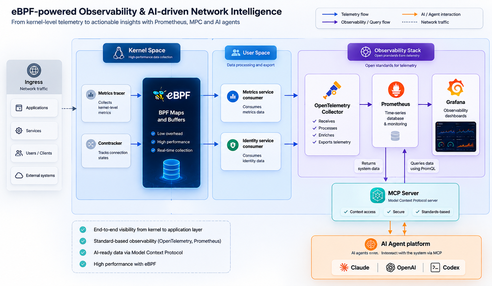

!!! note 
    CortexBrain is currently in active development so that occasional bugs may occur. Your contributions and feedback are foundamental for refining and enhancing the project! 🚀  

**CortexBrain** is an ambitious open-source project designed to build an intelligent, lightweight, and highly efficient monitoring platform for distributed cloud and hybrid (cloud–edge) workflows.  

---

## v0.1.5 Changelog
- Added memory, cpu and SSL (experimental) metrics
- Introduced OpenTelemetry protocol to aggregate the exported metrics
- Added metadata injection
- Added a startup example
- Improved core (refered as common) library structure
- Introduced MCP server (experimental)
- minor bug fixes

---

## **Current Development Stage**

You can see the development stage of every component here:

| **Component**       | **Latest Version**                | **Latest Commit** | **Referring Branch**  |**Related Milestone**
|---------------------|--------------------------|-------------------|-----------------------|-----------------------|
| **Identity Service**             | 0.1.1       |                  | `0.1.5`         | CortexBrain core v 0.1.0 |
| **Agent**           |  0.1.1  |                  | `0.1.5`        | CortexBrain core v 0.1.0 |
| **CLI**             | 0.1.5       |              | `0.1.5`         | CortexBrain CLI v .0.1 |

--- 
## Shortcuts
- [MCP server](./developer-guide/mcp-server.md)
- [Architecture overview](./developer-guide/architecture.md)
- [Glossary & Resources](./developer-guide/glossary.md)

---
# **An Introduction to Service Mesh**

A **service mesh** is a specialized infrastructure layer embedded within a software application that manages communication between services. It handles critical functions such as traffic routing, security, observability, and resiliency, while shielding individual services from these complexities.

In modern applications, functionality is often divided into a network of specialized services, each performing a specific task. To fulfill its role, a service may need to request data from multiple other services. However, issues arise when certain services, like a retailer’s inventory database, become overwhelmed with requests. This is where a service mesh proves invaluable. It orchestrates and optimizes the communication between services, ensuring all components work seamlessly together.

## **Challenges of Traditional Service Mesh**
While service meshes have proven beneficial for managing microservices, they come with inherent challenges. The traditional sidecar model introduces additional components and complexity, requiring teams to acquire new skills for effective management. A traditional "sidecar-based" service mesh has potential drawbacks that can impact directly the performances and the average costs of your clusters. Running sidecar containers alongside your containerized application directly impacts the CPU consumptions and the memory that your workloads consume. Due to its nature sidecar containers also have to work harder to collect data because they run in user space, and therefore don’t have direct access to kernel-level resources and the same reasoning can be applied to all the other service mesh features such as observability and security. The main drawbacks of a sidecar based service mesh can be resumed in the following chart:

| **Service mesh features**                         | **Drawbacks / Related issues**  |
|-----------------------------------|-----------------------------------------------------|
| **Overhead**    | Traditional sidecar approach introduce high overhead and resource consumption due to the attachment of a sidecar container. The sidecar is pretty expensive also in latency terms because every communication between pods are managed by the sidecar container|
| **Granularity**    | A sidecar approach is less customizable because has limited access to lower level insights    |

## **Service Mesh Optimization with eBPF**
eBPF is a powerful technology that allows for high-performance networking and security enhancements by executing code directly in the Linux kernel without changing the kernel source code or requiring a reboot. By leveraging eBPF, developers can attach programs to various network events, enabling efficient management of communication between microservices, enhanced metrics and observability and enhanced security features.

# **Architecture**
The CortexFlow architecture is designed to ensure a robust, scalable, and fault-tolerant system that can operate seamlessly without interruptions. It is composed of several key components that work together to provide a continuous and reliable infrastructure. These components are orchestrated within a Kubernetes cluster, ensuring efficient resource management, high availability, and scalability. Below is a GIF that visually represents the architecture and illustrates how the components interact within the cluster.

!!! note
    Since **v0.1.5** the metrics service can be deployed standalone using Docker like in this [example](https://github.com/CortexFlow/CortexBrain/tree/0.1.5/Examples/run-with-docker)

## What's eBPF?
Extended Berkeley Packet Filter (eBPF) presents a transformative approach to building service meshes by eliminating the need for the traditional sidecar model, which often introduces significant complexity and overhead in microservices architecture. eBPF allows for the implementation of service mesh functionalities directly in the kernel, resulting in a more efficient and streamlined data plane. This native integration minimizes the number of proxies required, reduces additional network connections, and simplifies redirection logic for network traffic, thereby enhancing performance.

## **User space vs kernel space**
In the Linux kernel the **user space** is the environment where user-facing applications run. This includes applications such as web servers, Chrome, text editors, and command utilities. User space applications are also known as userland applications.

User space applications cannot directly access the system’s hardware resources. They must make system calls to the kernel to request access to these resources.

Kernel space is where the core of the operating system, the kernel, operates. The kernel is responsible for managing the system’s resources, such as the CPU, memory, and storage. It also provides system calls, which are interfaces that allow userspace applications to interact with the kernel. The kernel has unrestricted access to the system’s hardware resources. This is necessary for the kernel to perform its essential tasks, such as scheduling processes, managing memory, and handling interrupts.

The CortexFlow architecture is built upon the Linux kernel, the core or the brain, referred as CortexBrain, interacts directly with the Linux kernel entities and, thanks to eBPF (Extended Berkley Packet Filter) CortexBrain can trace and extract relevant cluster insights before exiting the kernel space, this results in exact cluster metrics data without modifying its source code. eBPF is a virtual machine designed to run with the Linux kernel. eBPF programs are written in a C-like language, such as C itself or Rust. The code is compiled into bytecode and then checked by the BPF verifier, which analyzes the bytecode before it is executed in the kernel. The verifier scans how the program manipulates memory addresses and returns errors, not allowing the kernel to execute the program if some operation is considered suspicious. The verifier must track the range of all possible values in each register and so in each stack slot, for example, if a programs execute a function that assigns a memory address in a way that the verifier cannot prove its safety, the entire program will never be accepted as a valid program and so will never be executed. 

The execution flow of a BPF program can be resumed in four key steps:

- Program Loading: An application in the user space loads the compiled BPF program bytecode into the kernel. Typically, the program can be attached to an interface, a Kprobe, or a system call (syscall)
- Program verification: The verifier scans and analyzes the program to ensure its validity and safety
- Compilation: The JIT compiler translates the bytecode into native machine code
- Execution: The compiled code is executed by the kernel

This rigorous process ensures safety and maximum performance by molding itself with an event-driven approach, and so can be used as a foundation of an efficient monitoring system (Metrics and Observability in the graph above) and a fast networking plugin that we refer to in the illustration above as Identity Service.
