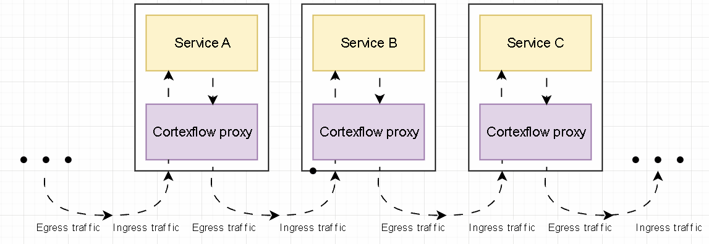

!!! note 
    CortexBrain is still in its development stages, so you can expect some bugs. Contributions and feedback are highly appreciated to help improve the project! 🚀  
**CortexBrain** is an ambitious open source project aimed at creating an intelligent, lightweight, and efficient architecture to seamlessly connect cloud and edge devices.  

## Current development stage
You can see the development stage of every component here:

| **Component**                         | **Stage**                                           | **Latest commit**     | **Referring Branch**                                                                                 |
|-----------------------------------|-----------------------------------------------------|---------------------------------|----------------------------|
| **Dashboard**    | 👨🏻‍🔬 Under development         |  | feature/frontend|
| **Client** | 👨🏻‍🔬 Under development| - | feature/core|
| **Proxy**           | 👨🏻‍🔬 Under development | - | feature/core|
| **Controller**        | 👨🏻‍🔬 Under development | -  | feature/core|
| **CLI**        | ❌ Not started yet | ❌  | feature/core|

## An introduction to service mesh
A service mesh is a specialized infrastructure layer embedded within a software application that manages communication between services. It handles critical functions such as traffic routing, security, observability, and resiliency, while shielding individual services from these complexities.
In modern applications, functionality is often divided into a network of specialized services, each performing a specific task. To fulfill its role, a service may need to request data from multiple other services. However, issues arise when certain services, like the retailer’s inventory database, become overwhelmed with requests. This is where a service mesh proves invaluable—it orchestrates and optimizes communication between services, ensuring all components work seamlessly together.
## Architecture

### Control Plane
#### Proxy Injector
#### Monitoring System
### Data Plane
#### Cortexflow proxy
The Cortexflow proxy is an essential part of the Cortexbrain service mesh. It's responsible for the communication between your application and the cluster. Cortexflow proxy acts as an intermediary for inbound and outbound traffic of the associated service without letting requiring application-level modifications. Up to now cortexflow proxy support:

- UDP/TCP traffic interception: cortexflow proxy service is able to intercept udp and tcp messages and forwards them to the kubernetes dns service. The default port for the udp traffic is the 5053 and the default part for the tcp traffic is the 5054
- Observability and Logging: cortexflow sidecar proxy collects metrics and errors and sends them to Prometheus to let the user see real time metrics

Using a more technical language we can say that the cortexflow proxy take the ingress traffic and allows the application in your cluster to seamlessly connect together using different protocols. To summerize, this is what the proxy mesh looks like:

