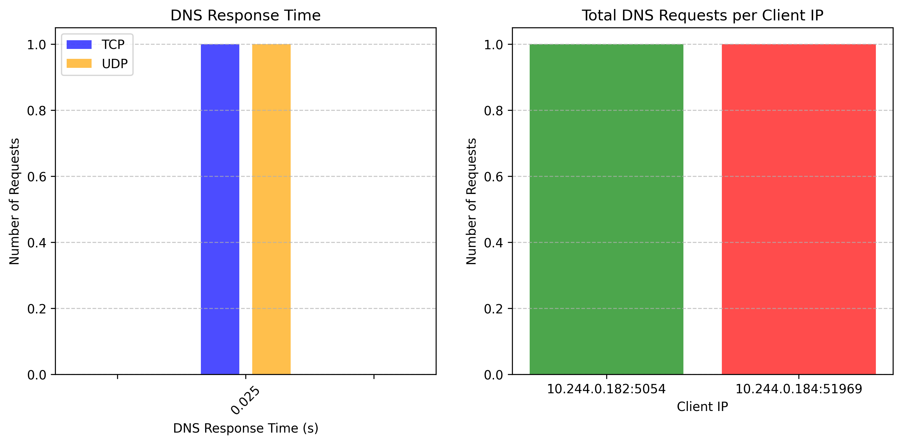
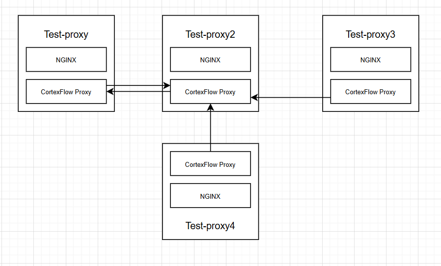
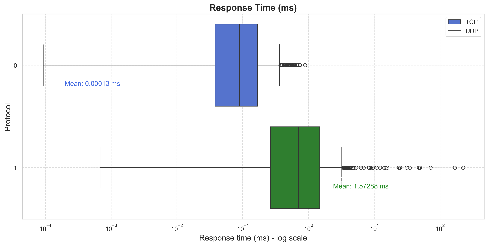

## Introduction:

This report summarizes the test results for CortexBrain during March 2025.  
Several tests were conducted to evaluate the performance of CortexBrain **proxy-sidecar** and CortexBrain **proxy-injector** in various scenarios.  
The results are presented in the following sections:

- **Proxy-Injector Tests**: Contains a list of tests performed to evaluate the injection functionalities.  
- **Sidecar-Proxy Tests**: Contains a list of tests performed to assess the proxy functionalities, including communication, service discovery, asynchronous communication, and metrics export.

## 🌟 CortexBrain Proxy-Injector tests

Below there's the complete list of tests

### Test : Injection

The tests confirm that the injector component is fully functional.The container [patch](https://github.com/CortexFlow/CortexBrain/blob/4d9c1092ccc083d7c6830d0891c96175d9b2dd77/core/src/components/proxy-injector/src/vars.rs#L4) is correctly injected into all pods with the appropriate label (`proxy-injection: enabled`). Tests were conducted using a test pod named test-proxy and the bash script [test-sidecar-proxy.sh](https://github.com/CortexFlow/CortexBrain/blob/main/Scripts/test-sidecar-proxy.sh).  

```bash
lorenzo@Lorenzo:~/CortexBrain/Scripts$ ./test-sidecar-proxy.sh
Testing Sidecar proxy injection
Checking pods
NAME                               READY   STATUS    RESTARTS         AGE     IP             NODE       NOMINATED NODE   READINESS GATES
cortexflow-proxy-9c94f5d6c-2w5t8   1/1     Running   16 (58s ago)     5d1h    10.244.0.179   minikube   <none>           <none>
proxy-injector                     1/1     Running   14 (2m14s ago)   5d1h    10.244.0.181   minikube   <none>           <none>
test-proxy                         2/2     Running   6 (2m14s ago)    3d12h   10.244.0.184   minikube   <none>           <none>
test-proxy2                        2/2     Running   6 (2m14s ago)    3d12h   10.244.0.182   minikube   <none>           <none>

Checking if the sidecar proxy is present
"proxy-sidecar"
"proxy-injector"
"nginx"
"proxy-sidecar"
"nginx"
"proxy-sidecar"
```

## 🌟 CortexBrain Proxy-Sidecar tests

Available Functionalities  

- **UDP Traffic**: Supports communication over port `5053`.  
- **TCP Traffic**: Supports communication over port `5054`.  
- **Metrics Export**: Provides real-time metrics for monitoring and analysis.  

Results:

| **Service**                      | **Test**                                                                 | **Result (✅/❌)**                                                                 | **Additional Notes**                                                                 |
|----------------------------------|--------------------------------------------------------------------------|----------------------------------------------------------------------------|-------------------------------------------------------------------------------------|
| **Service discovery**       | Pod IP resolution <br>  | ✅| restricted to the cortexflow namespace only|
| **Messaging**       | Support for JSON messages  | ✅|/|
| **Communication**       | - UDP (5053) port   <br> - TCP (5054) port <br>  | ✅|/|
| **Metrics**       | Metrics are successfully collected  | ✅|/|


!!! warning
    At the time this report is written, all the other functionalities, such as caching, mTLS, and policies, are in the development stage. We will gradually introduce eBPF into the project from April 2025.


### Test 1: Checking proxy open ports
The test confirm that the proxy component is functional. Tests were conducted using a test pod
called test-proxy and the bash script [test-sidecar-proxy.sh](https://github.com/CortexFlow/CortexBrain/blob/main/Scripts/test-sidecar-proxy.sh)

<details>
<summary> Click here to open the test details </summary>

```bash
Checking open ports in test-proxy
[{"containerPort":5053,"protocol":"UDP"},{"containerPort":5054,"protocol":"TCP"}] [{"containerPort":5054,"protocol":"TCP"},{"containerPort":5053,"protocol":"UDP"}]
[{"containerPort":5053,"protocol":"UDP"},{"containerPort":5054,"protocol":"TCP"}] [{"containerPort":5054,"protocol":"TCP"},{"containerPort":5053,"protocol":"UDP"}]

Checking network connections in test-proxy pod
Active Internet connections (only servers)
Proto Recv-Q Send-Q Local Address           Foreign Address         State       PID/Program name
tcp        0      0 0.0.0.0:80              0.0.0.0:*               LISTEN      -
tcp        0      0 0.0.0.0:5054            0.0.0.0:*               LISTEN      1/cortexflow-proxy
tcp        0      0 0.0.0.0:9090            0.0.0.0:*               LISTEN      1/cortexflow-proxy
tcp6       0      0 :::80                   :::*                    LISTEN      -
udp        0      0 0.0.0.0:5053            0.0.0.0:*                           1/cortexflow-proxy

Checking network connections in test-proxy2 pod
Active Internet connections (only servers)
Proto Recv-Q Send-Q Local Address           Foreign Address         State       PID/Program name
tcp        0      0 0.0.0.0:9090            0.0.0.0:*               LISTEN      1/cortexflow-proxy
tcp        0      0 0.0.0.0:5054            0.0.0.0:*               LISTEN      1/cortexflow-proxy
tcp        0      0 0.0.0.0:80              0.0.0.0:*               LISTEN      -
tcp6       0      0 :::80                   :::*                    LISTEN      -
udp        0      0 0.0.0.0:5053            0.0.0.0:*                           1/cortexflow-proxy
```

</details>

### Test 2: UDP communication

The test confirm that the UDP communication is functional. Tests were conducted using a test pod called test-proxy as sender and test-proxy2 as receiver
<details>
<summary> Click here to open the test details </summary>


```bash
TEST 2: Sending a message from test-proxy to test-proxy2 (UDP)
Starting UDP listener on port 5053...
Test: Incoming Message ⏳
{"status":"received"}{"status":"received"}✅ Test completed
```

</details>

Using tcpdump, we can capture UDP packets processed on port 5053. The following is the detailed output:

<details>
<summary> Click here to open the test details </summary>


```bash
lorenzo@Lorenzo:~$ kubectl exec -it test-proxy2 -c proxy-sidecar -n cortexflow -- tcpdump -i any port 5053 -nn -X
tcpdump: data link type LINUX_SLL2
tcpdump: verbose output suppressed, use -v[v]... for full protocol decode
listening on any, link-type LINUX_SLL2 (Linux cooked v2), snapshot length 262144 bytes
10:59:25.095047 eth0  In  IP 10.244.0.184.51969 > 10.244.0.182.5053: UDP, length 125
        0x0000:  4500 0099 38ba 4000 4011 ea44 0af4 00b8  E...8.@.@..D....
        0x0010:  0af4 00b6 cb01 13bd 0085 17ec 7b22 7365  ............{"se
        0x0020:  7276 6963 6522 3a22 7465 7374 2d70 726f  rvice":"test-pro
        0x0030:  7879 322e 636f 7274 6578 666c 6f77 222c  xy2.cortexflow",
        0x0040:  2264 6972 6563 7469 6f6e 223a 2249 6e63  "direction":"Inc
        0x0050:  6f6d 696e 6722 2c22 7061 796c 6f61 6422  oming","payload"
        0x0060:  3a22 6579 4a74 5a58 4e7a 5957 646c 496a  :"eyJtZXNzYWdlIj
        0x0070:  6f67 496b 686c 6247 7876 4947 5a79 6232  ogIkhlbGxvIGZyb2
        0x0080:  3067 6348 4a76 6548 6b74 6332 6c6b 5a57  0gcHJveHktc2lkZW
        0x0090:  4e68 6369 4a39 227d 0a                   NhciJ9"}.
10:59:25.148297 eth0  Out IP 10.244.0.182.5053 > 10.244.0.184.51969: UDP, length 21
        0x0000:  4500 0031 177e 4000 4011 0be9 0af4 00b6  E..1.~@.@.......
        0x0010:  0af4 00b8 13bd cb01 001d 1784 7b22 7374  ............{"st
        0x0020:  6174 7573 223a 2272 6563 6569 7665 6422  atus":"received"
        0x0030:  7d                                       }
10:59:25.148423 eth0  Out IP 10.244.0.182.5053 > 10.244.0.184.51969: UDP, length 21
        0x0000:  4500 0031 177f 4000 4011 0be8 0af4 00b6  E..1..@.@.......
        0x0010:  0af4 00b8 13bd cb01 001d 1784 7b22 7374  ............{"st
        0x0020:  6174 7573 223a 2272 6563 6569 7665 6422  atus":"received"
        0x0030:  7d                                       }
```

</details>


### Test 3: TCP communication

The test confirm that the TCP communication is functional. Tests were conducted using a test pod called test-proxy as sender and test-proxy2 as receiver

```bash
TEST 2: Checking if test-proxy can communicate with test-proxy2 (TCP)
Test: Incoming Message ⏳
{"status":"received"}Message ReceivedMessage Received✅ Test completed
```

Using tcpdump, we can capture TCP packets processed on port 5054. The following is the detailed output:

<details>
<summary> Click here to open the test details </summary>

```bash
lorenzo@Lorenzo:~$ kubectl exec -it test-proxy2 -c proxy-sidecar -n cortexflow -- tcpdump -i any port 5054 -nn -X
tcpdump: data link type LINUX_SLL2
tcpdump: verbose output suppressed, use -v[v]... for full protocol decode
listening on any, link-type LINUX_SLL2 (Linux cooked v2), snapshot length 262144 bytes
10:59:19.215746 eth0  In  IP 10.244.0.184.45108 > 10.244.0.182.5054: Flags [S], seq 2592051025, win 64240, options [mss 1460,sackOK,TS val 3611482804 ecr 0,nop,wscale 7], length 0
        0x0000:  4500 003c 5c4b 4000 4006 c71b 0af4 00b8  E..<\K@.@.......
        0x0010:  0af4 00b6 b034 13be 9a7f 8f51 0000 0000  .....4.....Q....
        0x0020:  a002 faf0 1784 0000 0204 05b4 0402 080a  ................
        0x0030:  d742 dab4 0000 0000 0103 0307            .B..........
10:59:19.215876 eth0  Out IP 10.244.0.182.5054 > 10.244.0.184.45108: Flags [S.], seq 907372687, ack 2592051026, win 65160, options [mss 1460,sackOK,TS val 2389105439 ecr 3611482804,nop,wscale 7], length 0
        0x0000:  4500 003c 0000 4000 4006 2367 0af4 00b6  E..<..@.@.#g....
        0x0010:  0af4 00b8 13be b034 3615 688f 9a7f 8f52  .......46.h....R
        0x0020:  a012 fe88 1784 0000 0204 05b4 0402 080a  ................
        0x0030:  8e66 db1f d742 dab4 0103 0307            .f...B......
10:59:19.215915 eth0  In  IP 10.244.0.184.45108 > 10.244.0.182.5054: Flags [.], ack 1, win 502, options [nop,nop,TS val 3611482804 ecr 2389105439], length 0
        0x0000:  4500 0034 5c4c 4000 4006 c722 0af4 00b8  E..4\L@.@.."....
        0x0010:  0af4 00b6 b034 13be 9a7f 8f52 3615 6890  .....4.....R6.h.
        0x0020:  8010 01f6 177c 0000 0101 080a d742 dab4  .....|.......B..
        0x0030:  8e66 db1f                                .f..
10:59:19.216138 eth0  In  IP 10.244.0.184.45108 > 10.244.0.182.5054: Flags [F.], seq 1, ack 1, win 502, options [nop,nop,TS val 3611482804 ecr 2389105439], length 0
        0x0000:  4500 0034 5c4d 4000 4006 c721 0af4 00b8  E..4\M@.@..!....
        0x0010:  0af4 00b6 b034 13be 9a7f 8f52 3615 6890  .....4.....R6.h.
        0x0020:  8011 01f6 177c 0000 0101 080a d742 dab4  .....|.......B..
        0x0030:  8e66 db1f                                .f..
10:59:19.218764 eth0  Out IP 10.244.0.182.5054 > 10.244.0.184.45108: Flags [.], ack 2, win 510, options [nop,nop,TS val 2389105442 ecr 3611482804], length 0
        0x0000:  4500 0034 6d57 4000 4006 b617 0af4 00b6  E..4mW@.@.......
        0x0010:  0af4 00b8 13be b034 3615 6890 9a7f 8f53  .......46.h....S
        0x0020:  8010 01fe 177c 0000 0101 080a 8e66 db22  .....|.......f."
        0x0030:  d742 dab4                                .B..
10:59:19.239614 eth0  Out IP 10.244.0.182.5054 > 10.244.0.184.45108: Flags [P.], seq 1:17, ack 2, win 510, options [nop,nop,TS val 2389105463 ecr 3611482804], length 16
        0x0000:  4500 0044 6d58 4000 4006 b606 0af4 00b6  E..DmX@.@.......
        0x0010:  0af4 00b8 13be b034 3615 6890 9a7f 8f53  .......46.h....S
        0x0020:  8018 01fe 178c 0000 0101 080a 8e66 db37  .............f.7
        0x0030:  d742 dab4 4d65 7373 6167 6520 5265 6365  .B..Message.Rece
        0x0040:  6976 6564                                ived
10:59:19.239732 eth0  In  IP 10.244.0.184.45108 > 10.244.0.182.5054: Flags [R], seq 2592051027, win 0, length 0
        0x0000:  4500 0028 0000 4000 4006 237b 0af4 00b8  E..(..@.@.#{....
        0x0010:  0af4 00b6 b034 13be 9a7f 8f53 0000 0000  .....4.....S....
        0x0020:  5004 0000 aac5 0000                      P.......
10:59:19.669707 eth0  In  IP 10.244.0.184.45120 > 10.244.0.182.5054: Flags [S], seq 235715412, win 64240, options [mss 1460,sackOK,TS val 3611483258 ecr 0,nop,wscale 7], length 0
        0x0000:  4500 003c df9e 4000 4006 43c8 0af4 00b8  E..<..@.@.C.....
        0x0010:  0af4 00b6 b040 13be 0e0c bb54 0000 0000  .....@.....T....
        0x0020:  a002 faf0 1784 0000 0204 05b4 0402 080a  ................
        0x0030:  d742 dc7a 0000 0000 0103 0307            .B.z........
10:59:19.669739 eth0  Out IP 10.244.0.182.5054 > 10.244.0.184.45120: Flags [S.], seq 2600685464, ack 235715413, win 65160, options [mss 1460,sackOK,TS val 2389105893 ecr 3611483258,nop,wscale 7], length 0
        0x0000:  4500 003c 0000 4000 4006 2367 0af4 00b6  E..<..@.@.#g....
        0x0010:  0af4 00b8 13be b040 9b03 4f98 0e0c bb55  .......@..O....U
        0x0020:  a012 fe88 1784 0000 0204 05b4 0402 080a  ................
        0x0030:  8e66 dce5 d742 dc7a 0103 0307            .f...B.z....
10:59:19.669776 eth0  In  IP 10.244.0.184.45120 > 10.244.0.182.5054: Flags [.], ack 1, win 502, options [nop,nop,TS val 3611483258 ecr 2389105893], length 0
        0x0000:  4500 0034 df9f 4000 4006 43cf 0af4 00b8  E..4..@.@.C.....
        0x0010:  0af4 00b6 b040 13be 0e0c bb55 9b03 4f99  .....@.....U..O.
        0x0020:  8010 01f6 177c 0000 0101 080a d742 dc7a  .....|.......B.z
        0x0030:  8e66 dce5                                .f..
10:59:19.669894 eth0  In  IP 10.244.0.184.45120 > 10.244.0.182.5054: Flags [P.], seq 1:126, ack 1, win 502, options [nop,nop,TS val 3611483258 ecr 2389105893], length 125
        0x0000:  4500 00b1 dfa0 4000 4006 4351 0af4 00b8  E.....@.@.CQ....
        0x0010:  0af4 00b6 b040 13be 0e0c bb55 9b03 4f99  .....@.....U..O.
        0x0020:  8018 01f6 17f9 0000 0101 080a d742 dc7a  .............B.z
        0x0030:  8e66 dce5 7b22 7365 7276 6963 6522 3a22  .f..{"service":"
        0x0040:  7465 7374 2d70 726f 7879 322e 636f 7274  test-proxy2.cort
        0x0050:  6578 666c 6f77 222c 2264 6972 6563 7469  exflow","directi
        0x0060:  6f6e 223a 2249 6e63 6f6d 696e 6722 2c22  on":"Incoming","
        0x0070:  7061 796c 6f61 6422 3a22 6579 4a77 5958  payload":"eyJwYX
        0x0080:  6c73 6232 466b 496a 6f67 496b 686c 6247  lsb2FkIjogIkhlbG
        0x0090:  7876 4947 5a79 6232 3067 6348 4a76 6548  xvIGZyb20gcHJveH
        0x00a0:  6b74 6332 6c6b 5a57 4e68 6369 4a39 227d  ktc2lkZWNhciJ9"}
        0x00b0:  0a                                       .
10:59:19.669904 eth0  Out IP 10.244.0.182.5054 > 10.244.0.184.45120: Flags [.], ack 126, win 509, options [nop,nop,TS val 2389105893 ecr 3611483258], length 0
        0x0000:  4500 0034 8131 4000 4006 a23d 0af4 00b6  E..4.1@.@..=....
        0x0010:  0af4 00b8 13be b040 9b03 4f99 0e0c bbd2  .......@..O.....
        0x0020:  8010 01fd 177c 0000 0101 080a 8e66 dce5  .....|.......f..
        0x0030:  d742 dc7a                                .B.z
10:59:19.733476 lo    In  IP 10.244.0.182.49858 > 10.244.0.182.5054: Flags [S], seq 2495395789, win 65495, options [mss 65495,sackOK,TS val 1960120607 ecr 0,nop,wscale 7], length 0
        0x0000:  4500 003c 800a 4000 4006 a35e 0af4 00b6  E..<..@.@..^....
        0x0010:  0af4 00b6 c2c2 13be 94bc b7cd 0000 0000  ................
        0x0020:  a002 ffd7 1782 0000 0204 ffd7 0402 080a  ................
        0x0030:  74d5 111f 0000 0000 0103 0307            t...........
10:59:19.733496 lo    In  IP 10.244.0.182.5054 > 10.244.0.182.49858: Flags [S.], seq 4063665784, ack 2495395790, win 65483, options [mss 65495,sackOK,TS val 1960120607 ecr 1960120607,nop,wscale 7], length 0
        0x0000:  4500 003c 0000 4000 4006 2369 0af4 00b6  E..<..@.@.#i....
        0x0010:  0af4 00b6 13be c2c2 f236 9e78 94bc b7ce  .........6.x....
        0x0020:  a012 ffcb 1782 0000 0204 ffd7 0402 080a  ................
        0x0030:  74d5 111f 74d5 111f 0103 0307            t...t.......
10:59:19.733514 lo    In  IP 10.244.0.182.49858 > 10.244.0.182.5054: Flags [.], ack 1, win 512, options [nop,nop,TS val 1960120607 ecr 1960120607], length 0
        0x0000:  4500 0034 800b 4000 4006 a365 0af4 00b6  E..4..@.@..e....
        0x0010:  0af4 00b6 c2c2 13be 94bc b7ce f236 9e79  .............6.y
        0x0020:  8010 0200 177a 0000 0101 080a 74d5 111f  .....z......t...
        0x0030:  74d5 111f                                t...
10:59:19.734675 lo    In  IP 10.244.0.182.49858 > 10.244.0.182.5054: Flags [P.], seq 1:139, ack 1, win 512, options [nop,nop,TS val 1960120609 ecr 1960120607], length 138
        0x0000:  4500 00be 800c 4000 4006 a2da 0af4 00b6  E.....@.@.......
        0x0010:  0af4 00b6 c2c2 13be 94bc b7ce f236 9e79  .............6.y
        0x0020:  8018 0200 1804 0000 0101 080a 74d5 1121  ............t..!
        0x0030:  74d5 111f 7b22 7061 796c 6f61 6422 3a22  t...{"payload":"
        0x0040:  6579 4a74 5a58 4e7a 5957 646c 496a 6f69  eyJtZXNzYWdlIjoi
        0x0050:  6531 7769 6347 4635 6247 3968 5a46 7769  e1wicGF5bG9hZFwi
        0x0060:  4f69 4263 496b 686c 6247 7876 4947 5a79  OiBcIkhlbGxvIGZy
        0x0070:  6232 3067 6348 4a76 6548 6b74 6332 6c6b  b20gcHJveHktc2lk
        0x0080:  5a57 4e68 636c 7769 6653 4a39 222c 2273  ZWNhclwifSJ9","s
        0x0090:  6572 7669 6365 223a 2274 6573 742d 7072  ervice":"test-pr
        0x00a0:  6f78 7932 222c 2264 6972 6563 7469 6f6e  oxy2","direction
        0x00b0:  223a 224f 7574 636f 6d69 6e67 227d       ":"Outcoming"}
10:59:19.734740 lo    In  IP 10.244.0.182.5054 > 10.244.0.182.49858: Flags [.], ack 139, win 511, options [nop,nop,TS val 1960120609 ecr 1960120609], length 0
        0x0000:  4500 0034 ca9c 4000 4006 58d4 0af4 00b6  E..4..@.@.X.....
        0x0010:  0af4 00b6 13be c2c2 f236 9e79 94bc b858  .........6.y...X
        0x0020:  8010 01ff 177a 0000 0101 080a 74d5 1121  .....z......t..!
        0x0030:  74d5 1121                                t..!
10:59:19.734972 lo    In  IP 10.244.0.182.5054 > 10.244.0.182.49858: Flags [P.], seq 1:22, ack 139, win 512, options [nop,nop,TS val 1960120609 ecr 1960120609], length 21
        0x0000:  4500 0049 ca9d 4000 4006 58be 0af4 00b6  E..I..@.@.X.....
        0x0010:  0af4 00b6 13be c2c2 f236 9e79 94bc b858  .........6.y...X
        0x0020:  8018 0200 178f 0000 0101 080a 74d5 1121  ............t..!
        0x0030:  74d5 1121 7b22 7374 6174 7573 223a 2272  t..!{"status":"r
        0x0040:  6563 6569 7665 6422 7d                   eceived"}
10:59:19.735041 lo    In  IP 10.244.0.182.49858 > 10.244.0.182.5054: Flags [.], ack 22, win 512, options [nop,nop,TS val 1960120609 ecr 1960120609], length 0
        0x0000:  4500 0034 800d 4000 4006 a363 0af4 00b6  E..4..@.@..c....
        0x0010:  0af4 00b6 c2c2 13be 94bc b858 f236 9e8e  ...........X.6..
        0x0020:  8010 0200 177a 0000 0101 080a 74d5 1121  .....z......t..!
        0x0030:  74d5 1121                                t..!
10:59:19.735069 lo    In  IP 10.244.0.182.5054 > 10.244.0.182.49858: Flags [P.], seq 22:38, ack 139, win 512, options [nop,nop,TS val 1960120609 ecr 1960120609], length 16
        0x0000:  4500 0044 ca9e 4000 4006 58c2 0af4 00b6  E..D..@.@.X.....
        0x0010:  0af4 00b6 13be c2c2 f236 9e8e 94bc b858  .........6.....X
        0x0020:  8018 0200 178a 0000 0101 080a 74d5 1121  ............t..!
        0x0030:  74d5 1121 4d65 7373 6167 6520 5265 6365  t..!Message.Rece
        0x0040:  6976 6564                                ived
10:59:19.735085 lo    In  IP 10.244.0.182.49858 > 10.244.0.182.5054: Flags [.], ack 38, win 512, options [nop,nop,TS val 1960120609 ecr 1960120609], length 0
        0x0000:  4500 0034 800e 4000 4006 a362 0af4 00b6  E..4..@.@..b....
        0x0010:  0af4 00b6 c2c2 13be 94bc b858 f236 9e9e  ...........X.6..
        0x0020:  8010 0200 177a 0000 0101 080a 74d5 1121  .....z......t..!
        0x0030:  74d5 1121                                t..!
10:59:19.735126 lo    In  IP 10.244.0.182.5054 > 10.244.0.182.49858: Flags [F.], seq 38, ack 139, win 512, options [nop,nop,TS val 1960120609 ecr 1960120609], length 0
        0x0000:  4500 0034 ca9f 4000 4006 58d1 0af4 00b6  E..4..@.@.X.....
        0x0010:  0af4 00b6 13be c2c2 f236 9e9e 94bc b858  .........6.....X
        0x0020:  8011 0200 177a 0000 0101 080a 74d5 1121  .....z......t..!
        0x0030:  74d5 1121                                t..!
10:59:19.735193 lo    In  IP 10.244.0.182.49858 > 10.244.0.182.5054: Flags [F.], seq 139, ack 39, win 512, options [nop,nop,TS val 1960120609 ecr 1960120609], length 0
        0x0000:  4500 0034 800f 4000 4006 a361 0af4 00b6  E..4..@.@..a....
        0x0010:  0af4 00b6 c2c2 13be 94bc b858 f236 9e9f  ...........X.6..
        0x0020:  8011 0200 177a 0000 0101 080a 74d5 1121  .....z......t..!
        0x0030:  74d5 1121                                t..!
10:59:19.735229 lo    In  IP 10.244.0.182.5054 > 10.244.0.182.49858: Flags [.], ack 140, win 512, options [nop,nop,TS val 1960120609 ecr 1960120609], length 0
        0x0000:  4500 0034 caa0 4000 4006 58d0 0af4 00b6  E..4..@.@.X.....
        0x0010:  0af4 00b6 13be c2c2 f236 9e9f 94bc b859  .........6.....Y
        0x0020:  8010 0200 177a 0000 0101 080a 74d5 1121  .....z......t..!
        0x0030:  74d5 1121                                t..!
10:59:19.735285 eth0  Out IP 10.244.0.182.5054 > 10.244.0.184.45120: Flags [P.], seq 1:38, ack 126, win 509, options [nop,nop,TS val 2389105958 ecr 3611483258], length 37
        0x0000:  4500 0059 8132 4000 4006 a217 0af4 00b6  E..Y.2@.@.......
        0x0010:  0af4 00b8 13be b040 9b03 4f99 0e0c bbd2  .......@..O.....
        0x0020:  8018 01fd 17a1 0000 0101 080a 8e66 dd26  .............f.&
        0x0030:  d742 dc7a 7b22 7374 6174 7573 223a 2272  .B.z{"status":"r
        0x0040:  6563 6569 7665 6422 7d4d 6573 7361 6765  eceived"}Message
        0x0050:  2052 6563 6569 7665 64                   .Received
10:59:19.735394 eth0  In  IP 10.244.0.184.45120 > 10.244.0.182.5054: Flags [.], ack 38, win 502, options [nop,nop,TS val 3611483323 ecr 2389105958], length 0
        0x0000:  4500 0034 dfa1 4000 4006 43cd 0af4 00b8  E..4..@.@.C.....
        0x0010:  0af4 00b6 b040 13be 0e0c bbd2 9b03 4fbe  .....@........O.
        0x0020:  8010 01f6 177c 0000 0101 080a d742 dcbb  .....|.......B..
        0x0030:  8e66 dd26                                .f.&
10:59:19.735423 eth0  Out IP 10.244.0.182.5054 > 10.244.0.184.45120: Flags [P.], seq 38:54, ack 126, win 509, options [nop,nop,TS val 2389105958 ecr 3611483323], length 16
        0x0000:  4500 0044 8133 4000 4006 a22b 0af4 00b6  E..D.3@.@..+....
        0x0010:  0af4 00b8 13be b040 9b03 4fbe 0e0c bbd2  .......@..O.....
        0x0020:  8018 01fd 178c 0000 0101 080a 8e66 dd26  .............f.&
        0x0030:  d742 dcbb 4d65 7373 6167 6520 5265 6365  .B..Message.Rece
        0x0040:  6976 6564                                ived
10:59:19.735468 eth0  In  IP 10.244.0.184.45120 > 10.244.0.182.5054: Flags [.], ack 54, win 502, options [nop,nop,TS val 3611483323 ecr 2389105958], length 0
        0x0000:  4500 0034 dfa2 4000 4006 43cc 0af4 00b8  E..4..@.@.C.....
        0x0010:  0af4 00b6 b040 13be 0e0c bbd2 9b03 4fce  .....@........O.
        0x0020:  8010 01f6 177c 0000 0101 080a d742 dcbb  .....|.......B..
        0x0030:  8e66 dd26                                .f.&
10:59:19.735505 eth0  Out IP 10.244.0.182.5054 > 10.244.0.184.45120: Flags [F.], seq 54, ack 126, win 509, options [nop,nop,TS val 2389105958 ecr 3611483323], length 0
        0x0000:  4500 0034 8134 4000 4006 a23a 0af4 00b6  E..4.4@.@..:....
        0x0010:  0af4 00b8 13be b040 9b03 4fce 0e0c bbd2  .......@..O.....
        0x0020:  8011 01fd 177c 0000 0101 080a 8e66 dd26  .....|.......f.&
        0x0030:  d742 dcbb                                .B..
10:59:19.735669 eth0  In  IP 10.244.0.184.45120 > 10.244.0.182.5054: Flags [F.], seq 126, ack 55, win 502, options [nop,nop,TS val 3611483324 ecr 2389105958], length 0
        0x0000:  4500 0034 dfa3 4000 4006 43cb 0af4 00b8  E..4..@.@.C.....
        0x0010:  0af4 00b6 b040 13be 0e0c bbd2 9b03 4fcf  .....@........O.
        0x0020:  8011 01f6 177c 0000 0101 080a d742 dcbc  .....|.......B..
        0x0030:  8e66 dd26                                .f.&
10:59:19.735685 eth0  Out IP 10.244.0.182.5054 > 10.244.0.184.45120: Flags [.], ack 127, win 509, options [nop,nop,TS val 2389105959 ecr 3611483324], length 0
        0x0000:  4500 0034 8135 4000 4006 a239 0af4 00b6  E..4.5@.@..9....
        0x0010:  0af4 00b8 13be b040 9b03 4fcf 0e0c bbd3  .......@..O.....
        0x0020:  8010 01fd 177c 0000 0101 080a 8e66 dd27  .....|.......f.'
        0x0030:  d742 dcbc                                .B..
```

</details>

### Test 4: Checking proxy metrics export

The test indicates that the metrics export is functional. Tests were conducted using the bash script [test-proxy-endpoints.sh](https://github.com/CortexFlow/CortexBrain/blob/main/Scripts/test-proxy-endpoints.sh)

<details>
<summary> Click here to open the test details </summary>


```bash
🔨 Testing /metrics endpoint
Defaulted container "nginx" out of: nginx, proxy-sidecar, init-iptables (init)
✅ Server is working
 Checking /metrics endpoint
Defaulted container "nginx" out of: nginx, proxy-sidecar, init-iptables (init)
  % Total    % Received % Xferd  Average Speed   Time    Time     Time  Current
                                 Dload  Upload   Total   Spent    Left  Speed
  0     0    0     0    0     0      0      0 --:--:-- --:--:-- --:--:--     0*   Trying 127.0.0.1:9090...
* Connected to localhost (127.0.0.1) port 9090 (#0)
> GET /metrics HTTP/1.1
> Host: localhost:9090
> User-Agent: curl/7.88.1
> Accept: */*
>
< HTTP/1.1 200 OK
< content-type: text/plain; charset=utf-8
< content-length: 2092
< date: Fri, 28 Mar 2025 11:00:29 GMT
<
{# HELP dns_response_time DNS_response_time
# TYPE dns_response_time histogram
dns_response_time_bucket{server="service_discovery",le="0.005"} 0
dns_response_time_bucket{server="service_discovery",le="0.01"} 0
dns_response_time_bucket{server="service_discovery",le="0.025"} 1
dns_response_time_bucket{server="service_discovery",le="0.05"} 1
dns_response_time_bucket{server="service_discovery",le="0.1"} 1
dns_response_time_bucket{server="service_discovery",le="0.25"} 1
dns_response_time_bucket{server="service_discovery",le="0.5"} 1
dns_response_time_bucket{server="service_discovery",le="1"} 1
dns_response_time_bucket{server="service_discovery",le="2.5"} 1
dns_response_time_bucket{server="service_discovery",le="5"} 1
dns_response_time_bucket{server="service_discovery",le="10"} 1
dns_response_time_bucket{server="service_discovery",le="+Inf"} 1
dns_response_time_sum{server="service_discovery"} 0.015117346
dns_response_time_count{server="service_discovery"} 1
dns_response_time_bucket{server="service_discovery_udp",le="0.005"} 0
dns_response_time_bucket{server="service_discovery_udp",le="0.01"} 0
dns_response_time_bucket{server="service_discovery_udp",le="0.025"} 1
dns_response_time_bucket{server="service_discovery_udp",le="0.05"} 1
dns_response_time_bucket{server="service_discovery_udp",le="0.1"} 1
dns_response_time_bucket{server="service_discovery_udp",le="0.25"} 1
dns_response_time_bucket{server="service_discovery_udp",le="0.5"} 1
dns_response_time_bucket{server="service_discovery_udp",le="1"} 1
dns_response_time_bucket{server="service_discovery_udp",le="2.5"} 1
dns_response_time_bucket{server="service_discovery_udp",le="5"} 1
dns_response_time_bucket{server="service_discovery_udp",le="10"} 1
dns_response_time_bucket{server="service_discovery_udp",le="+Inf"} 1
dns_response_time_sum{server="service_discovery_udp"} 0.011202774
dns_response_time_count{server="service_discovery_udp"} 1
# HELP total_dns_requests Total_DNS_Requests
# TYPE total_dns_requests counter
total_dns_requests{client_ip="10.244.0.182:5054"} 1
total_dns_requests{client_ip="10.244.0.184:51969"} 1
 [2092 bytes data]
100  2092  100  2092    0     0  1338k      0 --:--:-- --:--:-- --:--:-- 2042k
* Connection #0 to host localhost left intact
```

</details>

We can produce the results giving them a better visualization:


Since there's only one measure, no advanced statistical analysis can be used. Below a real case will be investigated

### Test 5: Asynchronus messaging 

In this test, we evaluate the latency differences between the TCP and UDP protocols.  
We use the following scripts:  

- [`test-sidecar-advanced-tcp.sh`](https://github.com/CortexFlow/CortexBrain/blob/feature/frontend/Scripts/test-sidecar-advanced-tcp.sh)  
- [`test-sidecar-advanced-udp.sh`](https://github.com/CortexFlow/CortexBrain/blob/feature/frontend/Scripts/test-sidecar-advanced-udp.sh)  

The test setup includes four testing pods: `test-proxy`, `test-proxy2`, `test-proxy3`, and `test-proxy4`. Every pod has two containers with `NGINX` and `cortexflow-proxy` 
 
**Note:**  
NGINX is not mandatory, you can use any other application as long as it is containerized. [How to containerize and application?](https://docs.docker.com/get-started/workshop/02_our_app/)  


### Test Structure  

The communication follows this sequence:  

1. `test-proxy` sends a message to `test-proxy2`.  
2. `test-proxy2` responds with a message to `test-proxy`.  
3. `test-proxy3` sends a message to `test-proxy2`.  
4. `test-proxy4` sends a message to `test-proxy2`.  

These actions are looped for 5 minutes, with multiple asynchronous requests sent at random intervals.  

The communication flow is illustrated in the following diagram:  

  

After 5 minutes, the test concludes, and results can be analyzed using the **metrics endpoint** of `test-proxy` (`/metrics`).  

<details>
<summary>Click here to open the raw results</summary>

```bash

🔨 Testing /metrics endpoint
Defaulted container "nginx" out of: nginx, proxy-sidecar, init-iptables (init)
✅ Server is working
 Checking /metrics endpoint
Defaulted container "nginx" out of: nginx, proxy-sidecar, init-iptables (init)
  % Total    % Received % Xferd  Average Speed   Time    Time     Time  Current
                                 Dload  Upload   Total   Spent    Left  Speed
  0     0    0     0    0     0      0      0 --:--:-- --:--:-- --:--:--     0*   Trying 127.0.0.1:9090...
* Connected to localhost (127.0.0.1) port 9090 (#0)
> GET /metrics HTTP/1.1
> Host: localhost:9090
> User-Agent: curl/7.88.1
> Accept: */*
>
< HTTP/1.1 200 OK
< content-type: text/plain; charset=utf-8
< content-length: 46860
< date: Sat, 29 Mar 2025 14:15:18 GMT

{ [46860 bytes data]
100 46860  100 46860    0     0  10.2M      0 --:--:-- --:--:-- --:--:-- 11.1M
* Connection #0 to host localhost left intact
# HELP dns_response_time DNS_response_time
# TYPE dns_response_time histogram
dns_response_time_bucket{server="service_discovery_tcp",le="0.005"} 900
dns_response_time_bucket{server="service_discovery_tcp",le="0.01"} 900
dns_response_time_bucket{server="service_discovery_tcp",le="0.025"} 900
dns_response_time_bucket{server="service_discovery_tcp",le="0.05"} 900
dns_response_time_bucket{server="service_discovery_tcp",le="0.1"} 900
dns_response_time_bucket{server="service_discovery_tcp",le="0.25"} 900
dns_response_time_bucket{server="service_discovery_tcp",le="0.5"} 900
dns_response_time_bucket{server="service_discovery_tcp",le="1"} 900
dns_response_time_bucket{server="service_discovery_tcp",le="2.5"} 900
dns_response_time_bucket{server="service_discovery_tcp",le="5"} 900
dns_response_time_bucket{server="service_discovery_tcp",le="10"} 900
dns_response_time_bucket{server="service_discovery_tcp",le="+Inf"} 900
dns_response_time_sum{server="service_discovery_tcp"} 0.00011784500000000017
dns_response_time_count{server="service_discovery_tcp"} 900
dns_response_time_bucket{server="service_discovery_udp",le="0.005"} 767
dns_response_time_bucket{server="service_discovery_udp",le="0.01"} 774
dns_response_time_bucket{server="service_discovery_udp",le="0.025"} 781
dns_response_time_bucket{server="service_discovery_udp",le="0.05"} 785
dns_response_time_bucket{server="service_discovery_udp",le="0.1"} 786
dns_response_time_bucket{server="service_discovery_udp",le="0.25"} 788
dns_response_time_bucket{server="service_discovery_udp",le="0.5"} 788
dns_response_time_bucket{server="service_discovery_udp",le="1"} 788
dns_response_time_bucket{server="service_discovery_udp",le="2.5"} 788
dns_response_time_bucket{server="service_discovery_udp",le="5"} 788
dns_response_time_bucket{server="service_discovery_udp",le="10"} 788
dns_response_time_bucket{server="service_discovery_udp",le="+Inf"} 788
dns_response_time_sum{server="service_discovery_udp"} 1.2394329659999987
dns_response_time_count{server="service_discovery_udp"} 788
# HELP total_dns_requests Total_DNS_Requests
# TYPE total_dns_requests counter
total_dns_requests{client_ip="10.244.0.246:5054_tcp"} 1800
total_dns_requests{client_ip="10.244.0.247:32846_udp"} 1
total_dns_requests{client_ip="10.244.0.247:32883_udp"} 1
total_dns_requests{client_ip="10.244.0.247:32984_udp"} 1
total_dns_requests{client_ip="10.244.0.247:33020_udp"} 1
total_dns_requests{client_ip="10.244.0.247:33085_udp"} 1
total_dns_requests{client_ip="10.244.0.247:33096_udp"} 1
total_dns_requests{client_ip="10.244.0.247:33186_udp"} 1
total_dns_requests{client_ip="10.244.0.247:33462_udp"} 1
total_dns_requests{client_ip="10.244.0.247:33488_udp"} 1
total_dns_requests{client_ip="10.244.0.247:33647_udp"} 1
total_dns_requests{client_ip="10.244.0.247:33663_udp"} 1
total_dns_requests{client_ip="10.244.0.247:33678_udp"} 1
total_dns_requests{client_ip="10.244.0.247:33738_udp"} 1
total_dns_requests{client_ip="10.244.0.247:34012_udp"} 1
total_dns_requests{client_ip="10.244.0.247:34193_udp"} 1
total_dns_requests{client_ip="10.244.0.247:34524_udp"} 1
total_dns_requests{client_ip="10.244.0.247:34687_udp"} 1
total_dns_requests{client_ip="10.244.0.247:34771_udp"} 1
total_dns_requests{client_ip="10.244.0.247:34785_udp"} 1
total_dns_requests{client_ip="10.244.0.247:34841_udp"} 1
total_dns_requests{client_ip="10.244.0.247:34894_udp"} 1
total_dns_requests{client_ip="10.244.0.247:35046_udp"} 1
total_dns_requests{client_ip="10.244.0.247:35102_udp"} 1
total_dns_requests{client_ip="10.244.0.247:35421_udp"} 1
total_dns_requests{client_ip="10.244.0.247:35437_udp"} 1
total_dns_requests{client_ip="10.244.0.247:35466_udp"} 1
total_dns_requests{client_ip="10.244.0.247:35525_udp"} 1
total_dns_requests{client_ip="10.244.0.247:35563_udp"} 1
total_dns_requests{client_ip="10.244.0.247:35573_udp"} 1
total_dns_requests{client_ip="10.244.0.247:35712_udp"} 1
total_dns_requests{client_ip="10.244.0.247:35720_udp"} 1
total_dns_requests{client_ip="10.244.0.247:35795_udp"} 1
total_dns_requests{client_ip="10.244.0.247:35970_udp"} 1
total_dns_requests{client_ip="10.244.0.247:36116_udp"} 1
total_dns_requests{client_ip="10.244.0.247:36270_udp"} 1
total_dns_requests{client_ip="10.244.0.247:36350_udp"} 1
total_dns_requests{client_ip="10.244.0.247:36425_udp"} 1
total_dns_requests{client_ip="10.244.0.247:36432_udp"} 1
total_dns_requests{client_ip="10.244.0.247:36448_udp"} 1
total_dns_requests{client_ip="10.244.0.247:36449_udp"} 1
total_dns_requests{client_ip="10.244.0.247:36714_udp"} 1
total_dns_requests{client_ip="10.244.0.247:36718_udp"} 1
total_dns_requests{client_ip="10.244.0.247:36961_udp"} 1
total_dns_requests{client_ip="10.244.0.247:37339_udp"} 1
total_dns_requests{client_ip="10.244.0.247:37342_udp"} 1
total_dns_requests{client_ip="10.244.0.247:37415_udp"} 1
total_dns_requests{client_ip="10.244.0.247:37724_udp"} 1
total_dns_requests{client_ip="10.244.0.247:37740_udp"} 1
total_dns_requests{client_ip="10.244.0.247:37853_udp"} 1
total_dns_requests{client_ip="10.244.0.247:37872_udp"} 1
total_dns_requests{client_ip="10.244.0.247:37913_udp"} 1
total_dns_requests{client_ip="10.244.0.247:37927_udp"} 1
total_dns_requests{client_ip="10.244.0.247:38126_udp"} 1
total_dns_requests{client_ip="10.244.0.247:38281_udp"} 1
total_dns_requests{client_ip="10.244.0.247:38444_udp"} 1
total_dns_requests{client_ip="10.244.0.247:38752_udp"} 1
total_dns_requests{client_ip="10.244.0.247:38833_udp"} 1
total_dns_requests{client_ip="10.244.0.247:38884_udp"} 1
total_dns_requests{client_ip="10.244.0.247:38917_udp"} 1
total_dns_requests{client_ip="10.244.0.247:38955_udp"} 1
total_dns_requests{client_ip="10.244.0.247:38960_udp"} 1
total_dns_requests{client_ip="10.244.0.247:39083_udp"} 1
total_dns_requests{client_ip="10.244.0.247:39142_udp"} 1
total_dns_requests{client_ip="10.244.0.247:39192_udp"} 1
total_dns_requests{client_ip="10.244.0.247:39227_udp"} 1
total_dns_requests{client_ip="10.244.0.247:39228_udp"} 1
total_dns_requests{client_ip="10.244.0.247:39262_udp"} 1
total_dns_requests{client_ip="10.244.0.247:39330_udp"} 1
total_dns_requests{client_ip="10.244.0.247:39464_udp"} 1
total_dns_requests{client_ip="10.244.0.247:39509_udp"} 1
total_dns_requests{client_ip="10.244.0.247:39662_udp"} 1
total_dns_requests{client_ip="10.244.0.247:39843_udp"} 1
total_dns_requests{client_ip="10.244.0.247:39868_udp"} 1
total_dns_requests{client_ip="10.244.0.247:39917_udp"} 1
total_dns_requests{client_ip="10.244.0.247:39985_udp"} 1
total_dns_requests{client_ip="10.244.0.247:40013_udp"} 1
total_dns_requests{client_ip="10.244.0.247:40039_udp"} 1
total_dns_requests{client_ip="10.244.0.247:40118_udp"} 1
total_dns_requests{client_ip="10.244.0.247:40149_udp"} 1
total_dns_requests{client_ip="10.244.0.247:40177_udp"} 1
total_dns_requests{client_ip="10.244.0.247:40194_udp"} 1
total_dns_requests{client_ip="10.244.0.247:40238_udp"} 1
total_dns_requests{client_ip="10.244.0.247:40263_udp"} 1
total_dns_requests{client_ip="10.244.0.247:40265_udp"} 1
total_dns_requests{client_ip="10.244.0.247:40383_udp"} 1
total_dns_requests{client_ip="10.244.0.247:40413_udp"} 1
total_dns_requests{client_ip="10.244.0.247:40430_udp"} 1
total_dns_requests{client_ip="10.244.0.247:40480_udp"} 1
total_dns_requests{client_ip="10.244.0.247:40659_udp"} 1
total_dns_requests{client_ip="10.244.0.247:41052_udp"} 1
total_dns_requests{client_ip="10.244.0.247:41139_udp"} 1
total_dns_requests{client_ip="10.244.0.247:41142_udp"} 1
total_dns_requests{client_ip="10.244.0.247:41176_udp"} 1
total_dns_requests{client_ip="10.244.0.247:41183_udp"} 1
total_dns_requests{client_ip="10.244.0.247:41249_udp"} 1
total_dns_requests{client_ip="10.244.0.247:41287_udp"} 1
total_dns_requests{client_ip="10.244.0.247:41499_udp"} 1
total_dns_requests{client_ip="10.244.0.247:41504_udp"} 1
total_dns_requests{client_ip="10.244.0.247:41598_udp"} 1
total_dns_requests{client_ip="10.244.0.247:41620_udp"} 1
total_dns_requests{client_ip="10.244.0.247:41632_udp"} 1
total_dns_requests{client_ip="10.244.0.247:41687_udp"} 1
total_dns_requests{client_ip="10.244.0.247:41720_udp"} 1
total_dns_requests{client_ip="10.244.0.247:41819_udp"} 1
total_dns_requests{client_ip="10.244.0.247:41926_udp"} 1
total_dns_requests{client_ip="10.244.0.247:42044_udp"} 1
total_dns_requests{client_ip="10.244.0.247:42087_udp"} 1
total_dns_requests{client_ip="10.244.0.247:42232_udp"} 1
total_dns_requests{client_ip="10.244.0.247:42251_udp"} 1
total_dns_requests{client_ip="10.244.0.247:42637_udp"} 1
total_dns_requests{client_ip="10.244.0.247:42685_udp"} 1
total_dns_requests{client_ip="10.244.0.247:42833_udp"} 1
total_dns_requests{client_ip="10.244.0.247:43041_udp"} 1
total_dns_requests{client_ip="10.244.0.247:43054_udp"} 1
total_dns_requests{client_ip="10.244.0.247:43445_udp"} 1
total_dns_requests{client_ip="10.244.0.247:43587_udp"} 1
total_dns_requests{client_ip="10.244.0.247:43729_udp"} 1
total_dns_requests{client_ip="10.244.0.247:43750_udp"} 1
total_dns_requests{client_ip="10.244.0.247:43866_udp"} 1
total_dns_requests{client_ip="10.244.0.247:43926_udp"} 1
total_dns_requests{client_ip="10.244.0.247:44129_udp"} 1
total_dns_requests{client_ip="10.244.0.247:44155_udp"} 1
total_dns_requests{client_ip="10.244.0.247:44409_udp"} 1
total_dns_requests{client_ip="10.244.0.247:44454_udp"} 1
total_dns_requests{client_ip="10.244.0.247:44480_udp"} 1
total_dns_requests{client_ip="10.244.0.247:44505_udp"} 1
total_dns_requests{client_ip="10.244.0.247:44658_udp"} 1
total_dns_requests{client_ip="10.244.0.247:44832_udp"} 1
total_dns_requests{client_ip="10.244.0.247:44848_udp"} 1
total_dns_requests{client_ip="10.244.0.247:44853_udp"} 1
total_dns_requests{client_ip="10.244.0.247:44886_udp"} 1
total_dns_requests{client_ip="10.244.0.247:45048_udp"} 1
total_dns_requests{client_ip="10.244.0.247:45230_udp"} 1
total_dns_requests{client_ip="10.244.0.247:45268_udp"} 1
total_dns_requests{client_ip="10.244.0.247:45456_udp"} 1
total_dns_requests{client_ip="10.244.0.247:45570_udp"} 1
total_dns_requests{client_ip="10.244.0.247:45700_udp"} 1
total_dns_requests{client_ip="10.244.0.247:45757_udp"} 1
total_dns_requests{client_ip="10.244.0.247:45774_udp"} 1
total_dns_requests{client_ip="10.244.0.247:45840_udp"} 1
total_dns_requests{client_ip="10.244.0.247:45920_udp"} 1
total_dns_requests{client_ip="10.244.0.247:45993_udp"} 1
total_dns_requests{client_ip="10.244.0.247:46131_udp"} 1
total_dns_requests{client_ip="10.244.0.247:46190_udp"} 1
total_dns_requests{client_ip="10.244.0.247:46226_udp"} 1
total_dns_requests{client_ip="10.244.0.247:46502_udp"} 1
total_dns_requests{client_ip="10.244.0.247:47028_udp"} 1
total_dns_requests{client_ip="10.244.0.247:47228_udp"} 1
total_dns_requests{client_ip="10.244.0.247:47324_udp"} 1
total_dns_requests{client_ip="10.244.0.247:47333_udp"} 1
total_dns_requests{client_ip="10.244.0.247:47334_udp"} 1
total_dns_requests{client_ip="10.244.0.247:47415_udp"} 1
total_dns_requests{client_ip="10.244.0.247:47666_udp"} 1
total_dns_requests{client_ip="10.244.0.247:47685_udp"} 1
total_dns_requests{client_ip="10.244.0.247:47691_udp"} 1
total_dns_requests{client_ip="10.244.0.247:47737_udp"} 1
total_dns_requests{client_ip="10.244.0.247:47761_udp"} 1
total_dns_requests{client_ip="10.244.0.247:47777_udp"} 1
total_dns_requests{client_ip="10.244.0.247:47784_udp"} 1
total_dns_requests{client_ip="10.244.0.247:47788_udp"} 1
total_dns_requests{client_ip="10.244.0.247:48014_udp"} 1
total_dns_requests{client_ip="10.244.0.247:48199_udp"} 1
total_dns_requests{client_ip="10.244.0.247:48261_udp"} 1
total_dns_requests{client_ip="10.244.0.247:48345_udp"} 1
total_dns_requests{client_ip="10.244.0.247:48361_udp"} 1
total_dns_requests{client_ip="10.244.0.247:48752_udp"} 1
total_dns_requests{client_ip="10.244.0.247:48803_udp"} 1
total_dns_requests{client_ip="10.244.0.247:48965_udp"} 1
total_dns_requests{client_ip="10.244.0.247:48982_udp"} 1
total_dns_requests{client_ip="10.244.0.247:49027_udp"} 1
total_dns_requests{client_ip="10.244.0.247:49038_udp"} 1
total_dns_requests{client_ip="10.244.0.247:49047_udp"} 1
total_dns_requests{client_ip="10.244.0.247:49171_udp"} 1
total_dns_requests{client_ip="10.244.0.247:49302_udp"} 1
total_dns_requests{client_ip="10.244.0.247:49414_udp"} 1
total_dns_requests{client_ip="10.244.0.247:49437_udp"} 1
total_dns_requests{client_ip="10.244.0.247:49562_udp"} 1
total_dns_requests{client_ip="10.244.0.247:49998_udp"} 1
total_dns_requests{client_ip="10.244.0.247:50827_udp"} 1
total_dns_requests{client_ip="10.244.0.247:50984_udp"} 1
total_dns_requests{client_ip="10.244.0.247:51010_udp"} 1
total_dns_requests{client_ip="10.244.0.247:51011_udp"} 1
total_dns_requests{client_ip="10.244.0.247:51104_udp"} 1
total_dns_requests{client_ip="10.244.0.247:51133_udp"} 1
total_dns_requests{client_ip="10.244.0.247:51152_udp"} 1
total_dns_requests{client_ip="10.244.0.247:51192_udp"} 1
total_dns_requests{client_ip="10.244.0.247:51193_udp"} 1
total_dns_requests{client_ip="10.244.0.247:51196_udp"} 1
total_dns_requests{client_ip="10.244.0.247:51341_udp"} 1
total_dns_requests{client_ip="10.244.0.247:51440_udp"} 1
total_dns_requests{client_ip="10.244.0.247:51607_udp"} 1
total_dns_requests{client_ip="10.244.0.247:52050_udp"} 1
total_dns_requests{client_ip="10.244.0.247:52067_udp"} 1
total_dns_requests{client_ip="10.244.0.247:52202_udp"} 1
total_dns_requests{client_ip="10.244.0.247:52221_udp"} 1
total_dns_requests{client_ip="10.244.0.247:52287_udp"} 1
total_dns_requests{client_ip="10.244.0.247:52367_udp"} 1
total_dns_requests{client_ip="10.244.0.247:52582_udp"} 1
total_dns_requests{client_ip="10.244.0.247:52793_udp"} 1
total_dns_requests{client_ip="10.244.0.247:52839_udp"} 1
total_dns_requests{client_ip="10.244.0.247:53043_udp"} 1
total_dns_requests{client_ip="10.244.0.247:53238_udp"} 1
total_dns_requests{client_ip="10.244.0.247:53293_udp"} 1
total_dns_requests{client_ip="10.244.0.247:54067_udp"} 1
total_dns_requests{client_ip="10.244.0.247:54169_udp"} 1
total_dns_requests{client_ip="10.244.0.247:54216_udp"} 1
total_dns_requests{client_ip="10.244.0.247:54409_udp"} 1
total_dns_requests{client_ip="10.244.0.247:54661_udp"} 1
total_dns_requests{client_ip="10.244.0.247:54993_udp"} 1
total_dns_requests{client_ip="10.244.0.247:55050_udp"} 1
total_dns_requests{client_ip="10.244.0.247:55111_udp"} 1
total_dns_requests{client_ip="10.244.0.247:55437_udp"} 1
total_dns_requests{client_ip="10.244.0.247:55524_udp"} 1
total_dns_requests{client_ip="10.244.0.247:55689_udp"} 1
total_dns_requests{client_ip="10.244.0.247:55833_udp"} 1
total_dns_requests{client_ip="10.244.0.247:55860_udp"} 1
total_dns_requests{client_ip="10.244.0.247:55960_udp"} 1
total_dns_requests{client_ip="10.244.0.247:55966_udp"} 1
total_dns_requests{client_ip="10.244.0.247:56209_udp"} 1
total_dns_requests{client_ip="10.244.0.247:56236_udp"} 1
total_dns_requests{client_ip="10.244.0.247:56314_udp"} 1
total_dns_requests{client_ip="10.244.0.247:56402_udp"} 1
total_dns_requests{client_ip="10.244.0.247:56491_udp"} 1
total_dns_requests{client_ip="10.244.0.247:56612_udp"} 1
total_dns_requests{client_ip="10.244.0.247:56839_udp"} 1
total_dns_requests{client_ip="10.244.0.247:57049_udp"} 1
total_dns_requests{client_ip="10.244.0.247:57094_udp"} 1
total_dns_requests{client_ip="10.244.0.247:57452_udp"} 1
total_dns_requests{client_ip="10.244.0.247:57524_udp"} 1
total_dns_requests{client_ip="10.244.0.247:57542_udp"} 1
total_dns_requests{client_ip="10.244.0.247:57675_udp"} 2
total_dns_requests{client_ip="10.244.0.247:57808_udp"} 1
total_dns_requests{client_ip="10.244.0.247:57820_udp"} 1
total_dns_requests{client_ip="10.244.0.247:57906_udp"} 1
total_dns_requests{client_ip="10.244.0.247:57939_udp"} 1
total_dns_requests{client_ip="10.244.0.247:58035_udp"} 2
total_dns_requests{client_ip="10.244.0.247:58154_udp"} 1
total_dns_requests{client_ip="10.244.0.247:58462_udp"} 1
total_dns_requests{client_ip="10.244.0.247:58600_udp"} 1
total_dns_requests{client_ip="10.244.0.247:58734_udp"} 1
total_dns_requests{client_ip="10.244.0.247:58758_udp"} 1
total_dns_requests{client_ip="10.244.0.247:58829_udp"} 1
total_dns_requests{client_ip="10.244.0.247:58903_udp"} 1
total_dns_requests{client_ip="10.244.0.247:59149_udp"} 1
total_dns_requests{client_ip="10.244.0.247:59727_udp"} 1
total_dns_requests{client_ip="10.244.0.247:59736_udp"} 1
total_dns_requests{client_ip="10.244.0.247:59848_udp"} 1
total_dns_requests{client_ip="10.244.0.247:59882_udp"} 1
total_dns_requests{client_ip="10.244.0.247:59974_udp"} 1
total_dns_requests{client_ip="10.244.0.247:60230_udp"} 1
total_dns_requests{client_ip="10.244.0.247:60250_udp"} 1
total_dns_requests{client_ip="10.244.0.247:60335_udp"} 1
total_dns_requests{client_ip="10.244.0.247:60353_udp"} 1
total_dns_requests{client_ip="10.244.0.247:60416_udp"} 1
total_dns_requests{client_ip="10.244.0.247:60614_udp"} 1
total_dns_requests{client_ip="10.244.0.247:60619_udp"} 1
total_dns_requests{client_ip="10.244.0.247:60722_udp"} 1
total_dns_requests{client_ip="10.244.0.247:60803_udp"} 1
total_dns_requests{client_ip="10.244.0.247:60853_udp"} 1
total_dns_requests{client_ip="10.244.0.247:60872_udp"} 1
total_dns_requests{client_ip="10.244.0.247:60955_udp"} 1
total_dns_requests{client_ip="10.244.0.248:33031_udp"} 1
total_dns_requests{client_ip="10.244.0.248:33364_udp"} 1
total_dns_requests{client_ip="10.244.0.248:33385_udp"} 1
total_dns_requests{client_ip="10.244.0.248:33453_udp"} 1
total_dns_requests{client_ip="10.244.0.248:33483_udp"} 1
total_dns_requests{client_ip="10.244.0.248:33533_udp"} 1
total_dns_requests{client_ip="10.244.0.248:33631_udp"} 1
total_dns_requests{client_ip="10.244.0.248:33852_udp"} 1
total_dns_requests{client_ip="10.244.0.248:33876_udp"} 1
total_dns_requests{client_ip="10.244.0.248:33953_udp"} 1
total_dns_requests{client_ip="10.244.0.248:34105_udp"} 1
total_dns_requests{client_ip="10.244.0.248:34331_udp"} 1
total_dns_requests{client_ip="10.244.0.248:34399_udp"} 1
total_dns_requests{client_ip="10.244.0.248:34462_udp"} 1
total_dns_requests{client_ip="10.244.0.248:34541_udp"} 1
total_dns_requests{client_ip="10.244.0.248:34571_udp"} 1
total_dns_requests{client_ip="10.244.0.248:34772_udp"} 1
total_dns_requests{client_ip="10.244.0.248:34817_udp"} 1
total_dns_requests{client_ip="10.244.0.248:34871_udp"} 1
total_dns_requests{client_ip="10.244.0.248:34933_udp"} 1
total_dns_requests{client_ip="10.244.0.248:34976_udp"} 1
total_dns_requests{client_ip="10.244.0.248:35336_udp"} 1
total_dns_requests{client_ip="10.244.0.248:35417_udp"} 1
total_dns_requests{client_ip="10.244.0.248:35612_udp"} 1
total_dns_requests{client_ip="10.244.0.248:35667_udp"} 1
total_dns_requests{client_ip="10.244.0.248:35708_udp"} 1
total_dns_requests{client_ip="10.244.0.248:35714_udp"} 1
total_dns_requests{client_ip="10.244.0.248:35763_udp"} 1
total_dns_requests{client_ip="10.244.0.248:35901_udp"} 1
total_dns_requests{client_ip="10.244.0.248:35956_udp"} 1
total_dns_requests{client_ip="10.244.0.248:36020_udp"} 1
total_dns_requests{client_ip="10.244.0.248:36054_udp"} 1
total_dns_requests{client_ip="10.244.0.248:36124_udp"} 1
total_dns_requests{client_ip="10.244.0.248:36189_udp"} 1
total_dns_requests{client_ip="10.244.0.248:36347_udp"} 1
total_dns_requests{client_ip="10.244.0.248:36359_udp"} 1
total_dns_requests{client_ip="10.244.0.248:36435_udp"} 1
total_dns_requests{client_ip="10.244.0.248:36533_udp"} 1
total_dns_requests{client_ip="10.244.0.248:36658_udp"} 1
total_dns_requests{client_ip="10.244.0.248:36801_udp"} 1
total_dns_requests{client_ip="10.244.0.248:36832_udp"} 1
total_dns_requests{client_ip="10.244.0.248:36836_udp"} 1
total_dns_requests{client_ip="10.244.0.248:36963_udp"} 1
total_dns_requests{client_ip="10.244.0.248:37267_udp"} 1
total_dns_requests{client_ip="10.244.0.248:37431_udp"} 1
total_dns_requests{client_ip="10.244.0.248:37557_udp"} 1
total_dns_requests{client_ip="10.244.0.248:37579_udp"} 1
total_dns_requests{client_ip="10.244.0.248:37786_udp"} 1
total_dns_requests{client_ip="10.244.0.248:37796_udp"} 1
total_dns_requests{client_ip="10.244.0.248:37843_udp"} 1
total_dns_requests{client_ip="10.244.0.248:38207_udp"} 1
total_dns_requests{client_ip="10.244.0.248:38236_udp"} 1
total_dns_requests{client_ip="10.244.0.248:38267_udp"} 1
total_dns_requests{client_ip="10.244.0.248:38414_udp"} 1
total_dns_requests{client_ip="10.244.0.248:38607_udp"} 1
total_dns_requests{client_ip="10.244.0.248:38648_udp"} 1
total_dns_requests{client_ip="10.244.0.248:38656_udp"} 1
total_dns_requests{client_ip="10.244.0.248:38728_udp"} 1
total_dns_requests{client_ip="10.244.0.248:38897_udp"} 1
total_dns_requests{client_ip="10.244.0.248:38936_udp"} 1
total_dns_requests{client_ip="10.244.0.248:38967_udp"} 1
total_dns_requests{client_ip="10.244.0.248:39095_udp"} 1
total_dns_requests{client_ip="10.244.0.248:39109_udp"} 1
total_dns_requests{client_ip="10.244.0.248:39134_udp"} 1
total_dns_requests{client_ip="10.244.0.248:39148_udp"} 1
total_dns_requests{client_ip="10.244.0.248:39203_udp"} 1
total_dns_requests{client_ip="10.244.0.248:39462_udp"} 1
total_dns_requests{client_ip="10.244.0.248:39521_udp"} 1
total_dns_requests{client_ip="10.244.0.248:39920_udp"} 1
total_dns_requests{client_ip="10.244.0.248:40041_udp"} 1
total_dns_requests{client_ip="10.244.0.248:40112_udp"} 1
total_dns_requests{client_ip="10.244.0.248:40205_udp"} 1
total_dns_requests{client_ip="10.244.0.248:40225_udp"} 1
total_dns_requests{client_ip="10.244.0.248:40289_udp"} 1
total_dns_requests{client_ip="10.244.0.248:40344_udp"} 1
total_dns_requests{client_ip="10.244.0.248:40371_udp"} 1
total_dns_requests{client_ip="10.244.0.248:40581_udp"} 1
total_dns_requests{client_ip="10.244.0.248:40600_udp"} 1
total_dns_requests{client_ip="10.244.0.248:40773_udp"} 1
total_dns_requests{client_ip="10.244.0.248:40887_udp"} 1
total_dns_requests{client_ip="10.244.0.248:41128_udp"} 1
total_dns_requests{client_ip="10.244.0.248:41184_udp"} 1
total_dns_requests{client_ip="10.244.0.248:41190_udp"} 1
total_dns_requests{client_ip="10.244.0.248:41212_udp"} 1
total_dns_requests{client_ip="10.244.0.248:41285_udp"} 1
total_dns_requests{client_ip="10.244.0.248:41595_udp"} 1
total_dns_requests{client_ip="10.244.0.248:41600_udp"} 1
total_dns_requests{client_ip="10.244.0.248:41656_udp"} 1
total_dns_requests{client_ip="10.244.0.248:41673_udp"} 1
total_dns_requests{client_ip="10.244.0.248:41735_udp"} 1
total_dns_requests{client_ip="10.244.0.248:41749_udp"} 1
total_dns_requests{client_ip="10.244.0.248:41755_udp"} 1
total_dns_requests{client_ip="10.244.0.248:42024_udp"} 1
total_dns_requests{client_ip="10.244.0.248:42516_udp"} 1
total_dns_requests{client_ip="10.244.0.248:42706_udp"} 1
total_dns_requests{client_ip="10.244.0.248:42788_udp"} 1
total_dns_requests{client_ip="10.244.0.248:42803_udp"} 1
total_dns_requests{client_ip="10.244.0.248:42936_udp"} 1
total_dns_requests{client_ip="10.244.0.248:43021_udp"} 1
total_dns_requests{client_ip="10.244.0.248:43023_udp"} 1
total_dns_requests{client_ip="10.244.0.248:43307_udp"} 1
total_dns_requests{client_ip="10.244.0.248:43320_udp"} 1
total_dns_requests{client_ip="10.244.0.248:43345_udp"} 1
total_dns_requests{client_ip="10.244.0.248:43445_udp"} 1
total_dns_requests{client_ip="10.244.0.248:43607_udp"} 1
total_dns_requests{client_ip="10.244.0.248:43704_udp"} 1
total_dns_requests{client_ip="10.244.0.248:44029_udp"} 1
total_dns_requests{client_ip="10.244.0.248:44087_udp"} 1
total_dns_requests{client_ip="10.244.0.248:44094_udp"} 1
total_dns_requests{client_ip="10.244.0.248:44134_udp"} 1
total_dns_requests{client_ip="10.244.0.248:44597_udp"} 1
total_dns_requests{client_ip="10.244.0.248:44948_udp"} 1
total_dns_requests{client_ip="10.244.0.248:45013_udp"} 1
total_dns_requests{client_ip="10.244.0.248:45069_udp"} 1
total_dns_requests{client_ip="10.244.0.248:45092_udp"} 1
total_dns_requests{client_ip="10.244.0.248:45179_udp"} 1
total_dns_requests{client_ip="10.244.0.248:45458_udp"} 1
total_dns_requests{client_ip="10.244.0.248:45467_udp"} 1
total_dns_requests{client_ip="10.244.0.248:45678_udp"} 1
total_dns_requests{client_ip="10.244.0.248:45680_udp"} 1
total_dns_requests{client_ip="10.244.0.248:45693_udp"} 1
total_dns_requests{client_ip="10.244.0.248:45773_udp"} 1
total_dns_requests{client_ip="10.244.0.248:45835_udp"} 1
total_dns_requests{client_ip="10.244.0.248:45849_udp"} 1
total_dns_requests{client_ip="10.244.0.248:45960_udp"} 1
total_dns_requests{client_ip="10.244.0.248:46014_udp"} 1
total_dns_requests{client_ip="10.244.0.248:46369_udp"} 1
total_dns_requests{client_ip="10.244.0.248:46431_udp"} 1
total_dns_requests{client_ip="10.244.0.248:46568_udp"} 1
total_dns_requests{client_ip="10.244.0.248:46797_udp"} 1
total_dns_requests{client_ip="10.244.0.248:46970_udp"} 1
total_dns_requests{client_ip="10.244.0.248:46989_udp"} 1
total_dns_requests{client_ip="10.244.0.248:47092_udp"} 1
total_dns_requests{client_ip="10.244.0.248:47234_udp"} 1
total_dns_requests{client_ip="10.244.0.248:47568_udp"} 1
total_dns_requests{client_ip="10.244.0.248:47582_udp"} 1
total_dns_requests{client_ip="10.244.0.248:47611_udp"} 1
total_dns_requests{client_ip="10.244.0.248:47655_udp"} 1
total_dns_requests{client_ip="10.244.0.248:47661_udp"} 1
total_dns_requests{client_ip="10.244.0.248:47741_udp"} 1
total_dns_requests{client_ip="10.244.0.248:47922_udp"} 1
total_dns_requests{client_ip="10.244.0.248:47950_udp"} 1
total_dns_requests{client_ip="10.244.0.248:47966_udp"} 1
total_dns_requests{client_ip="10.244.0.248:48006_udp"} 1
total_dns_requests{client_ip="10.244.0.248:48059_udp"} 1
total_dns_requests{client_ip="10.244.0.248:48569_udp"} 1
total_dns_requests{client_ip="10.244.0.248:48728_udp"} 1
total_dns_requests{client_ip="10.244.0.248:48736_udp"} 1
total_dns_requests{client_ip="10.244.0.248:48799_udp"} 1
total_dns_requests{client_ip="10.244.0.248:48901_udp"} 1
total_dns_requests{client_ip="10.244.0.248:49049_udp"} 1
total_dns_requests{client_ip="10.244.0.248:49199_udp"} 1
total_dns_requests{client_ip="10.244.0.248:49265_udp"} 1
total_dns_requests{client_ip="10.244.0.248:49382_udp"} 1
total_dns_requests{client_ip="10.244.0.248:49574_udp"} 1
total_dns_requests{client_ip="10.244.0.248:49708_udp"} 1
total_dns_requests{client_ip="10.244.0.248:50102_udp"} 1
total_dns_requests{client_ip="10.244.0.248:50286_udp"} 1
total_dns_requests{client_ip="10.244.0.248:50461_udp"} 1
total_dns_requests{client_ip="10.244.0.248:50492_udp"} 1
total_dns_requests{client_ip="10.244.0.248:50833_udp"} 1
total_dns_requests{client_ip="10.244.0.248:50928_udp"} 1
total_dns_requests{client_ip="10.244.0.248:51004_udp"} 1
total_dns_requests{client_ip="10.244.0.248:51073_udp"} 1
total_dns_requests{client_ip="10.244.0.248:51151_udp"} 1
total_dns_requests{client_ip="10.244.0.248:51243_udp"} 1
total_dns_requests{client_ip="10.244.0.248:51340_udp"} 1
total_dns_requests{client_ip="10.244.0.248:51352_udp"} 1
total_dns_requests{client_ip="10.244.0.248:51376_udp"} 1
total_dns_requests{client_ip="10.244.0.248:51729_udp"} 1
total_dns_requests{client_ip="10.244.0.248:51893_udp"} 1
total_dns_requests{client_ip="10.244.0.248:51959_udp"} 1
total_dns_requests{client_ip="10.244.0.248:52296_udp"} 1
total_dns_requests{client_ip="10.244.0.248:52307_udp"} 1
total_dns_requests{client_ip="10.244.0.248:52366_udp"} 1
total_dns_requests{client_ip="10.244.0.248:52480_udp"} 1
total_dns_requests{client_ip="10.244.0.248:52573_udp"} 1
total_dns_requests{client_ip="10.244.0.248:52696_udp"} 1
total_dns_requests{client_ip="10.244.0.248:52732_udp"} 1
total_dns_requests{client_ip="10.244.0.248:52745_udp"} 1
total_dns_requests{client_ip="10.244.0.248:52911_udp"} 1
total_dns_requests{client_ip="10.244.0.248:52972_udp"} 1
total_dns_requests{client_ip="10.244.0.248:53042_udp"} 1
total_dns_requests{client_ip="10.244.0.248:53061_udp"} 1
total_dns_requests{client_ip="10.244.0.248:53137_udp"} 1
total_dns_requests{client_ip="10.244.0.248:53153_udp"} 1
total_dns_requests{client_ip="10.244.0.248:53565_udp"} 1
total_dns_requests{client_ip="10.244.0.248:53781_udp"} 1
total_dns_requests{client_ip="10.244.0.248:54010_udp"} 1
total_dns_requests{client_ip="10.244.0.248:54110_udp"} 1
total_dns_requests{client_ip="10.244.0.248:54141_udp"} 1
total_dns_requests{client_ip="10.244.0.248:54296_udp"} 1
total_dns_requests{client_ip="10.244.0.248:54345_udp"} 1
total_dns_requests{client_ip="10.244.0.248:54406_udp"} 1
total_dns_requests{client_ip="10.244.0.248:54414_udp"} 1
total_dns_requests{client_ip="10.244.0.248:54535_udp"} 1
total_dns_requests{client_ip="10.244.0.248:54537_udp"} 1
total_dns_requests{client_ip="10.244.0.248:54564_udp"} 1
total_dns_requests{client_ip="10.244.0.248:54744_udp"} 1
total_dns_requests{client_ip="10.244.0.248:54865_udp"} 1
total_dns_requests{client_ip="10.244.0.248:54980_udp"} 1
total_dns_requests{client_ip="10.244.0.248:55013_udp"} 1
total_dns_requests{client_ip="10.244.0.248:55047_udp"} 1
total_dns_requests{client_ip="10.244.0.248:55129_udp"} 1
total_dns_requests{client_ip="10.244.0.248:55282_udp"} 1
total_dns_requests{client_ip="10.244.0.248:55302_udp"} 1
total_dns_requests{client_ip="10.244.0.248:55512_udp"} 1
total_dns_requests{client_ip="10.244.0.248:55513_udp"} 1
total_dns_requests{client_ip="10.244.0.248:55525_udp"} 1
total_dns_requests{client_ip="10.244.0.248:55640_udp"} 1
total_dns_requests{client_ip="10.244.0.248:55672_udp"} 1
total_dns_requests{client_ip="10.244.0.248:55792_udp"} 1
total_dns_requests{client_ip="10.244.0.248:56118_udp"} 1
total_dns_requests{client_ip="10.244.0.248:56249_udp"} 1
total_dns_requests{client_ip="10.244.0.248:56613_udp"} 1
total_dns_requests{client_ip="10.244.0.248:56700_udp"} 1
total_dns_requests{client_ip="10.244.0.248:56707_udp"} 1
total_dns_requests{client_ip="10.244.0.248:56751_udp"} 1
total_dns_requests{client_ip="10.244.0.248:56802_udp"} 1
total_dns_requests{client_ip="10.244.0.248:56881_udp"} 1
total_dns_requests{client_ip="10.244.0.248:57090_udp"} 1
total_dns_requests{client_ip="10.244.0.248:57178_udp"} 1
total_dns_requests{client_ip="10.244.0.248:57450_udp"} 1
total_dns_requests{client_ip="10.244.0.248:57558_udp"} 1
total_dns_requests{client_ip="10.244.0.248:58020_udp"} 1
total_dns_requests{client_ip="10.244.0.248:58141_udp"} 1
total_dns_requests{client_ip="10.244.0.248:58145_udp"} 1
total_dns_requests{client_ip="10.244.0.248:58191_udp"} 1
total_dns_requests{client_ip="10.244.0.248:58313_udp"} 1
total_dns_requests{client_ip="10.244.0.248:58332_udp"} 1
total_dns_requests{client_ip="10.244.0.248:58423_udp"} 1
total_dns_requests{client_ip="10.244.0.248:58440_udp"} 1
total_dns_requests{client_ip="10.244.0.248:58496_udp"} 1
total_dns_requests{client_ip="10.244.0.248:58539_udp"} 1
total_dns_requests{client_ip="10.244.0.248:58775_udp"} 1
total_dns_requests{client_ip="10.244.0.248:59035_udp"} 1
total_dns_requests{client_ip="10.244.0.248:59056_udp"} 1
total_dns_requests{client_ip="10.244.0.248:59153_udp"} 1
total_dns_requests{client_ip="10.244.0.248:59154_udp"} 1
total_dns_requests{client_ip="10.244.0.248:59190_udp"} 1
total_dns_requests{client_ip="10.244.0.248:59231_udp"} 1
total_dns_requests{client_ip="10.244.0.248:59265_udp"} 1
total_dns_requests{client_ip="10.244.0.248:59290_udp"} 1
total_dns_requests{client_ip="10.244.0.248:59332_udp"} 1
total_dns_requests{client_ip="10.244.0.248:59416_udp"} 1
total_dns_requests{client_ip="10.244.0.248:59530_udp"} 1
total_dns_requests{client_ip="10.244.0.248:59553_udp"} 1
total_dns_requests{client_ip="10.244.0.248:59609_udp"} 1
total_dns_requests{client_ip="10.244.0.248:59713_udp"} 1
total_dns_requests{client_ip="10.244.0.248:59754_udp"} 1
total_dns_requests{client_ip="10.244.0.248:59800_udp"} 1
total_dns_requests{client_ip="10.244.0.248:59917_udp"} 1
total_dns_requests{client_ip="10.244.0.248:60082_udp"} 1
total_dns_requests{client_ip="10.244.0.248:60194_udp"} 1
total_dns_requests{client_ip="10.244.0.248:60235_udp"} 1
total_dns_requests{client_ip="10.244.0.248:60283_udp"} 1
total_dns_requests{client_ip="10.244.0.248:60406_udp"} 2
total_dns_requests{client_ip="10.244.0.248:60409_udp"} 1
total_dns_requests{client_ip="10.244.0.248:60477_udp"} 1
total_dns_requests{client_ip="10.244.0.248:60623_udp"} 1
total_dns_requests{client_ip="10.244.0.248:60745_udp"} 1
total_dns_requests{client_ip="10.244.0.248:60819_udp"} 1
total_dns_requests{client_ip="10.244.0.249:32864_udp"} 1
total_dns_requests{client_ip="10.244.0.249:32924_udp"} 1
total_dns_requests{client_ip="10.244.0.249:33104_udp"} 1
total_dns_requests{client_ip="10.244.0.249:33126_udp"} 1
total_dns_requests{client_ip="10.244.0.249:33179_udp"} 1
total_dns_requests{client_ip="10.244.0.249:33314_udp"} 1
total_dns_requests{client_ip="10.244.0.249:33579_udp"} 1
total_dns_requests{client_ip="10.244.0.249:33929_udp"} 1
total_dns_requests{client_ip="10.244.0.249:34027_udp"} 1
total_dns_requests{client_ip="10.244.0.249:34080_udp"} 1
total_dns_requests{client_ip="10.244.0.249:34152_udp"} 1
total_dns_requests{client_ip="10.244.0.249:34378_udp"} 1
total_dns_requests{client_ip="10.244.0.249:34784_udp"} 1
total_dns_requests{client_ip="10.244.0.249:34848_udp"} 1
total_dns_requests{client_ip="10.244.0.249:34985_udp"} 1
total_dns_requests{client_ip="10.244.0.249:35097_udp"} 1
total_dns_requests{client_ip="10.244.0.249:35169_udp"} 1
total_dns_requests{client_ip="10.244.0.249:35202_udp"} 1
total_dns_requests{client_ip="10.244.0.249:35385_udp"} 1
total_dns_requests{client_ip="10.244.0.249:35417_udp"} 1
total_dns_requests{client_ip="10.244.0.249:35521_udp"} 1
total_dns_requests{client_ip="10.244.0.249:35609_udp"} 2
total_dns_requests{client_ip="10.244.0.249:35648_udp"} 1
total_dns_requests{client_ip="10.244.0.249:35657_udp"} 1
total_dns_requests{client_ip="10.244.0.249:35695_udp"} 1
total_dns_requests{client_ip="10.244.0.249:35823_udp"} 1
total_dns_requests{client_ip="10.244.0.249:36016_udp"} 1
total_dns_requests{client_ip="10.244.0.249:36727_udp"} 1
total_dns_requests{client_ip="10.244.0.249:36757_udp"} 1
total_dns_requests{client_ip="10.244.0.249:36786_udp"} 1
total_dns_requests{client_ip="10.244.0.249:36891_udp"} 1
total_dns_requests{client_ip="10.244.0.249:36913_udp"} 1
total_dns_requests{client_ip="10.244.0.249:36940_udp"} 1
total_dns_requests{client_ip="10.244.0.249:36944_udp"} 1
total_dns_requests{client_ip="10.244.0.249:37098_udp"} 1
total_dns_requests{client_ip="10.244.0.249:37103_udp"} 1
total_dns_requests{client_ip="10.244.0.249:37281_udp"} 1
total_dns_requests{client_ip="10.244.0.249:37304_udp"} 1
total_dns_requests{client_ip="10.244.0.249:37449_udp"} 1
total_dns_requests{client_ip="10.244.0.249:37465_udp"} 1
total_dns_requests{client_ip="10.244.0.249:37488_udp"} 1
total_dns_requests{client_ip="10.244.0.249:37518_udp"} 1
total_dns_requests{client_ip="10.244.0.249:37560_udp"} 1
total_dns_requests{client_ip="10.244.0.249:37730_udp"} 1
total_dns_requests{client_ip="10.244.0.249:37871_udp"} 1
total_dns_requests{client_ip="10.244.0.249:37886_udp"} 1
total_dns_requests{client_ip="10.244.0.249:37911_udp"} 1
total_dns_requests{client_ip="10.244.0.249:37913_udp"} 1
total_dns_requests{client_ip="10.244.0.249:38109_udp"} 1
total_dns_requests{client_ip="10.244.0.249:38130_udp"} 1
total_dns_requests{client_ip="10.244.0.249:38193_udp"} 1
total_dns_requests{client_ip="10.244.0.249:38277_udp"} 1
total_dns_requests{client_ip="10.244.0.249:38348_udp"} 1
total_dns_requests{client_ip="10.244.0.249:38352_udp"} 1
total_dns_requests{client_ip="10.244.0.249:38414_udp"} 1
total_dns_requests{client_ip="10.244.0.249:38596_udp"} 1
total_dns_requests{client_ip="10.244.0.249:38906_udp"} 1
total_dns_requests{client_ip="10.244.0.249:38962_udp"} 1
total_dns_requests{client_ip="10.244.0.249:39016_udp"} 1
total_dns_requests{client_ip="10.244.0.249:39123_udp"} 1
total_dns_requests{client_ip="10.244.0.249:39277_udp"} 1
total_dns_requests{client_ip="10.244.0.249:39359_udp"} 1
total_dns_requests{client_ip="10.244.0.249:39397_udp"} 1
total_dns_requests{client_ip="10.244.0.249:39631_udp"} 1
total_dns_requests{client_ip="10.244.0.249:39719_udp"} 1
total_dns_requests{client_ip="10.244.0.249:39742_udp"} 1
total_dns_requests{client_ip="10.244.0.249:39800_udp"} 1
total_dns_requests{client_ip="10.244.0.249:39887_udp"} 1
total_dns_requests{client_ip="10.244.0.249:40062_udp"} 1
total_dns_requests{client_ip="10.244.0.249:40137_udp"} 1
total_dns_requests{client_ip="10.244.0.249:40170_udp"} 1
total_dns_requests{client_ip="10.244.0.249:40267_udp"} 1
total_dns_requests{client_ip="10.244.0.249:40409_udp"} 1
total_dns_requests{client_ip="10.244.0.249:40430_udp"} 1
total_dns_requests{client_ip="10.244.0.249:40497_udp"} 1
total_dns_requests{client_ip="10.244.0.249:40516_udp"} 1
total_dns_requests{client_ip="10.244.0.249:40540_udp"} 1
total_dns_requests{client_ip="10.244.0.249:40696_udp"} 1
total_dns_requests{client_ip="10.244.0.249:40746_udp"} 1
total_dns_requests{client_ip="10.244.0.249:40777_udp"} 1
total_dns_requests{client_ip="10.244.0.249:40923_udp"} 1
total_dns_requests{client_ip="10.244.0.249:40993_udp"} 1
total_dns_requests{client_ip="10.244.0.249:41094_udp"} 1
total_dns_requests{client_ip="10.244.0.249:41313_udp"} 1
total_dns_requests{client_ip="10.244.0.249:41319_udp"} 1
total_dns_requests{client_ip="10.244.0.249:41425_udp"} 1
total_dns_requests{client_ip="10.244.0.249:41473_udp"} 1
total_dns_requests{client_ip="10.244.0.249:41542_udp"} 1
total_dns_requests{client_ip="10.244.0.249:41686_udp"} 1
total_dns_requests{client_ip="10.244.0.249:41699_udp"} 1
total_dns_requests{client_ip="10.244.0.249:41701_udp"} 1
total_dns_requests{client_ip="10.244.0.249:41853_udp"} 1
total_dns_requests{client_ip="10.244.0.249:41945_udp"} 1
total_dns_requests{client_ip="10.244.0.249:42046_udp"} 1
total_dns_requests{client_ip="10.244.0.249:42066_udp"} 1
total_dns_requests{client_ip="10.244.0.249:42216_udp"} 1
total_dns_requests{client_ip="10.244.0.249:42270_udp"} 1
total_dns_requests{client_ip="10.244.0.249:42356_udp"} 1
total_dns_requests{client_ip="10.244.0.249:42373_udp"} 1
total_dns_requests{client_ip="10.244.0.249:42429_udp"} 1
total_dns_requests{client_ip="10.244.0.249:42537_udp"} 1
total_dns_requests{client_ip="10.244.0.249:42545_udp"} 1
total_dns_requests{client_ip="10.244.0.249:42553_udp"} 1
total_dns_requests{client_ip="10.244.0.249:42622_udp"} 1
total_dns_requests{client_ip="10.244.0.249:42685_udp"} 1
total_dns_requests{client_ip="10.244.0.249:42973_udp"} 1
total_dns_requests{client_ip="10.244.0.249:43057_udp"} 1
total_dns_requests{client_ip="10.244.0.249:43347_udp"} 1
total_dns_requests{client_ip="10.244.0.249:43397_udp"} 1
total_dns_requests{client_ip="10.244.0.249:43447_udp"} 1
total_dns_requests{client_ip="10.244.0.249:43487_udp"} 1
total_dns_requests{client_ip="10.244.0.249:43648_udp"} 1
total_dns_requests{client_ip="10.244.0.249:43664_udp"} 1
total_dns_requests{client_ip="10.244.0.249:43712_udp"} 1
total_dns_requests{client_ip="10.244.0.249:43799_udp"} 1
total_dns_requests{client_ip="10.244.0.249:43939_udp"} 1
total_dns_requests{client_ip="10.244.0.249:44326_udp"} 1
total_dns_requests{client_ip="10.244.0.249:44456_udp"} 1
total_dns_requests{client_ip="10.244.0.249:44548_udp"} 1
total_dns_requests{client_ip="10.244.0.249:44553_udp"} 1
total_dns_requests{client_ip="10.244.0.249:44583_udp"} 1
total_dns_requests{client_ip="10.244.0.249:44925_udp"} 1
total_dns_requests{client_ip="10.244.0.249:44926_udp"} 1
total_dns_requests{client_ip="10.244.0.249:44974_udp"} 1
total_dns_requests{client_ip="10.244.0.249:45033_udp"} 1
total_dns_requests{client_ip="10.244.0.249:45077_udp"} 1
total_dns_requests{client_ip="10.244.0.249:45188_udp"} 1
total_dns_requests{client_ip="10.244.0.249:45373_udp"} 1
total_dns_requests{client_ip="10.244.0.249:45422_udp"} 1
total_dns_requests{client_ip="10.244.0.249:45511_udp"} 1
total_dns_requests{client_ip="10.244.0.249:45654_udp"} 1
total_dns_requests{client_ip="10.244.0.249:45985_udp"} 1
total_dns_requests{client_ip="10.244.0.249:45993_udp"} 1
total_dns_requests{client_ip="10.244.0.249:46261_udp"} 1
total_dns_requests{client_ip="10.244.0.249:46326_udp"} 1
total_dns_requests{client_ip="10.244.0.249:46432_udp"} 1
total_dns_requests{client_ip="10.244.0.249:46531_udp"} 1
total_dns_requests{client_ip="10.244.0.249:46586_udp"} 1
total_dns_requests{client_ip="10.244.0.249:46686_udp"} 1
total_dns_requests{client_ip="10.244.0.249:46841_udp"} 1
total_dns_requests{client_ip="10.244.0.249:46985_udp"} 1
total_dns_requests{client_ip="10.244.0.249:46999_udp"} 1
total_dns_requests{client_ip="10.244.0.249:47092_udp"} 1
total_dns_requests{client_ip="10.244.0.249:47425_udp"} 1
total_dns_requests{client_ip="10.244.0.249:47497_udp"} 1
total_dns_requests{client_ip="10.244.0.249:47597_udp"} 1
total_dns_requests{client_ip="10.244.0.249:48112_udp"} 1
total_dns_requests{client_ip="10.244.0.249:48154_udp"} 1
total_dns_requests{client_ip="10.244.0.249:48269_udp"} 1
total_dns_requests{client_ip="10.244.0.249:48736_udp"} 1
total_dns_requests{client_ip="10.244.0.249:48849_udp"} 1
total_dns_requests{client_ip="10.244.0.249:49009_udp"} 1
total_dns_requests{client_ip="10.244.0.249:49438_udp"} 1
total_dns_requests{client_ip="10.244.0.249:49457_udp"} 1
total_dns_requests{client_ip="10.244.0.249:49498_udp"} 1
total_dns_requests{client_ip="10.244.0.249:49536_udp"} 1
total_dns_requests{client_ip="10.244.0.249:49735_udp"} 1
total_dns_requests{client_ip="10.244.0.249:49754_udp"} 1
total_dns_requests{client_ip="10.244.0.249:49925_udp"} 1
total_dns_requests{client_ip="10.244.0.249:50084_udp"} 1
total_dns_requests{client_ip="10.244.0.249:50088_udp"} 1
total_dns_requests{client_ip="10.244.0.249:50150_udp"} 1
total_dns_requests{client_ip="10.244.0.249:50212_udp"} 1
total_dns_requests{client_ip="10.244.0.249:50583_udp"} 1
total_dns_requests{client_ip="10.244.0.249:50755_udp"} 1
total_dns_requests{client_ip="10.244.0.249:50984_udp"} 1
total_dns_requests{client_ip="10.244.0.249:51033_udp"} 1
total_dns_requests{client_ip="10.244.0.249:51035_udp"} 1
total_dns_requests{client_ip="10.244.0.249:51088_udp"} 1
total_dns_requests{client_ip="10.244.0.249:51228_udp"} 1
total_dns_requests{client_ip="10.244.0.249:51355_udp"} 1
total_dns_requests{client_ip="10.244.0.249:51392_udp"} 1
total_dns_requests{client_ip="10.244.0.249:51619_udp"} 1
total_dns_requests{client_ip="10.244.0.249:51687_udp"} 1
total_dns_requests{client_ip="10.244.0.249:51934_udp"} 1
total_dns_requests{client_ip="10.244.0.249:51975_udp"} 1
total_dns_requests{client_ip="10.244.0.249:52089_udp"} 1
total_dns_requests{client_ip="10.244.0.249:52261_udp"} 1
total_dns_requests{client_ip="10.244.0.249:52384_udp"} 1
total_dns_requests{client_ip="10.244.0.249:52401_udp"} 1
total_dns_requests{client_ip="10.244.0.249:52411_udp"} 1
total_dns_requests{client_ip="10.244.0.249:52417_udp"} 1
total_dns_requests{client_ip="10.244.0.249:52461_udp"} 1
total_dns_requests{client_ip="10.244.0.249:52509_udp"} 1
total_dns_requests{client_ip="10.244.0.249:52677_udp"} 1
total_dns_requests{client_ip="10.244.0.249:52968_udp"} 1
total_dns_requests{client_ip="10.244.0.249:53146_udp"} 1
total_dns_requests{client_ip="10.244.0.249:53169_udp"} 1
total_dns_requests{client_ip="10.244.0.249:53292_udp"} 1
total_dns_requests{client_ip="10.244.0.249:53735_udp"} 1
total_dns_requests{client_ip="10.244.0.249:53955_udp"} 1
total_dns_requests{client_ip="10.244.0.249:54005_udp"} 1
total_dns_requests{client_ip="10.244.0.249:54015_udp"} 1
total_dns_requests{client_ip="10.244.0.249:54115_udp"} 1
total_dns_requests{client_ip="10.244.0.249:54153_udp"} 1
total_dns_requests{client_ip="10.244.0.249:54298_udp"} 1
total_dns_requests{client_ip="10.244.0.249:54357_udp"} 1
total_dns_requests{client_ip="10.244.0.249:54459_udp"} 1
total_dns_requests{client_ip="10.244.0.249:54462_udp"} 1
total_dns_requests{client_ip="10.244.0.249:54491_udp"} 1
total_dns_requests{client_ip="10.244.0.249:54575_udp"} 1
total_dns_requests{client_ip="10.244.0.249:54588_udp"} 1
total_dns_requests{client_ip="10.244.0.249:54704_udp"} 1
total_dns_requests{client_ip="10.244.0.249:54712_udp"} 1
total_dns_requests{client_ip="10.244.0.249:54744_udp"} 1
total_dns_requests{client_ip="10.244.0.249:54770_udp"} 1
total_dns_requests{client_ip="10.244.0.249:54786_udp"} 1
total_dns_requests{client_ip="10.244.0.249:54866_udp"} 1
total_dns_requests{client_ip="10.244.0.249:54892_udp"} 1
total_dns_requests{client_ip="10.244.0.249:54899_udp"} 1
total_dns_requests{client_ip="10.244.0.249:54927_udp"} 1
total_dns_requests{client_ip="10.244.0.249:55008_udp"} 1
total_dns_requests{client_ip="10.244.0.249:55059_udp"} 1
total_dns_requests{client_ip="10.244.0.249:55060_udp"} 1
total_dns_requests{client_ip="10.244.0.249:55247_udp"} 1
total_dns_requests{client_ip="10.244.0.249:55264_udp"} 1
total_dns_requests{client_ip="10.244.0.249:55297_udp"} 1
total_dns_requests{client_ip="10.244.0.249:55299_udp"} 1
total_dns_requests{client_ip="10.244.0.249:55459_udp"} 1
total_dns_requests{client_ip="10.244.0.249:55567_udp"} 1
total_dns_requests{client_ip="10.244.0.249:55837_udp"} 1
total_dns_requests{client_ip="10.244.0.249:55849_udp"} 1
total_dns_requests{client_ip="10.244.0.249:56069_udp"} 1
total_dns_requests{client_ip="10.244.0.249:56111_udp"} 1
total_dns_requests{client_ip="10.244.0.249:56241_udp"} 1
total_dns_requests{client_ip="10.244.0.249:56390_udp"} 1
total_dns_requests{client_ip="10.244.0.249:56504_udp"} 1
total_dns_requests{client_ip="10.244.0.249:56777_udp"} 1
total_dns_requests{client_ip="10.244.0.249:56789_udp"} 1
total_dns_requests{client_ip="10.244.0.249:56801_udp"} 1
total_dns_requests{client_ip="10.244.0.249:57216_udp"} 1
total_dns_requests{client_ip="10.244.0.249:57557_udp"} 1
total_dns_requests{client_ip="10.244.0.249:57815_udp"} 1
total_dns_requests{client_ip="10.244.0.249:58081_udp"} 1
total_dns_requests{client_ip="10.244.0.249:58596_udp"} 1
total_dns_requests{client_ip="10.244.0.249:58621_udp"} 1
total_dns_requests{client_ip="10.244.0.249:58640_udp"} 1
total_dns_requests{client_ip="10.244.0.249:58751_udp"} 1
total_dns_requests{client_ip="10.244.0.249:58863_udp"} 1
total_dns_requests{client_ip="10.244.0.249:58891_udp"} 1
total_dns_requests{client_ip="10.244.0.249:59056_udp"} 1
total_dns_requests{client_ip="10.244.0.249:59107_udp"} 1
total_dns_requests{client_ip="10.244.0.249:59240_udp"} 1
total_dns_requests{client_ip="10.244.0.249:59403_udp"} 1
total_dns_requests{client_ip="10.244.0.249:59416_udp"} 1
total_dns_requests{client_ip="10.244.0.249:59435_udp"} 1
total_dns_requests{client_ip="10.244.0.249:59572_udp"} 1
total_dns_requests{client_ip="10.244.0.249:59618_udp"} 1
total_dns_requests{client_ip="10.244.0.249:59746_udp"} 1
total_dns_requests{client_ip="10.244.0.249:59760_udp"} 1
total_dns_requests{client_ip="10.244.0.249:59763_udp"} 1
total_dns_requests{client_ip="10.244.0.249:59766_udp"} 1
total_dns_requests{client_ip="10.244.0.249:59797_udp"} 1
total_dns_requests{client_ip="10.244.0.249:59978_udp"} 1
total_dns_requests{client_ip="10.244.0.249:60138_udp"} 1
total_dns_requests{client_ip="10.244.0.249:60176_udp"} 1
total_dns_requests{client_ip="10.244.0.249:60360_udp"} 1
total_dns_requests{client_ip="10.244.0.249:60673_udp"} 1
total_dns_requests{client_ip="10.244.0.249:60689_udp"} 1
total_dns_requests{client_ip="10.244.0.249:60927_udp"} 1
total_dns_requests{client_ip="10.244.0.249:60933_udp"} 1
```
</details>


The results of our tests can be resumed with this table:

| Protocol | Total dns requests | Mean response time (ms) |
| ------- | ------- |-------|
| TCP | 788 | 0.00013 |
| UDP | 900 | 1.57288 |

Without too much effort we can extract more details from the raw data using a boxplot to better visualize and compare the results that we obtained from the test:


## Summary and conclusions

In this report, we analyze the proxy-injector and proxy functionalities following their latest introduction in March 2025.  
Specifically, we evaluate TCP and UDP communication between services in a distributed Kubernetes environment. The results confirm that the proxy is fully functional and capable of processing TCP and UDP JSON messages.  
Future updates will focus on expanding its capabilities, with a particular emphasis on transitioning to a **proxyless architecture**.  
Once implemented, we will conduct a new performance comparison against the current test results.  