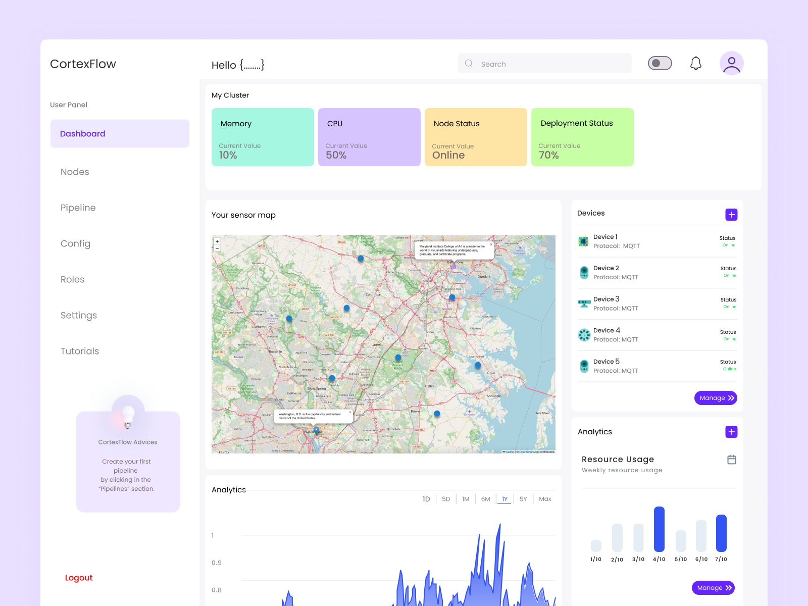

# CortexBrain © 2025 

[](https://github.com/CortexFlow/CortexBrain/releases) 

[](https://www.docker.com)
[](https://trello.com/invite/b/66c731aab6030598aef7aed3/ATTIdfd7d08e42dca6f8b56a8b26f499ab8c95EB547E/cortexbrain)
[](./doc.md)
[](./LICENSE)
[](https://github.com/CortexFlow/CortexBrain/discussions)
[](https://github.com/CortexFlow/CortexBrain#contributing)
[](https://kubernetes.io)  

[](https://dev.to/cortexflow)
 



## 📬Contacts

- **Tettamanti Lorenzo**  [📧 lorenzotettamanti5@gmail.com](mailto:lorenzotettamanti5@gmail.com)

- **Lorenzo Bradanini**  [📧 lorenzolollobrada@gmail.com](mailto:lorenzolollobrada@gmail.com)

# 🧑‍💻What is CortexBrain?
**CortexBrain** is an ambitious open source project aimed at creating an intelligent, lightweight, and efficient architecture to seamlessly connect cloud and edge devices.  

# ⚛️ **Current Development Focus**  
The current development efforts are focused on the following improvements:

- 🔧 **Optimizing the DNS Server:** Enhance dns features for greater network efficiency.  
- 🌐 **Adding a Custom Proxy:** Provide flexible routing for device communications.  
- 📊 **Implementing Load Balancing Techniques:** Optimize traffic distribution to improve scalability and performance.  
- 📡 **Integrating a Container Network Interface (CNI):** Enable advanced container networking for better interoperability.  

# 🤖 Getting Started

CortexBrain is still in its development stages, so you can expect some bugs. Contributions and feedback are highly appreciated to help improve the project! 🚀  
Below there's a guide to get started

## 🥷 Install from source
To get started with CortexBrain, follow these steps:

- **Clone the Repository**: First, clone the repository to your local machine.

   ```bash
   git clone https://github.com/CortexFlow/CortexBrain.git
    ```

- **Install required packages**:

   | **Feature**              | **Requirements**                                                                 |
   | ------------------------- | -------------------------------------------------------------------------------- |
   | **CortexBrain Core**      | - Kubernetes or Minikube v1.34.0  <br> - Linux Ubuntu system (preferred for development)  <br> - Rust programming language (rustc >= 1.83.0)|
   | **CortexBrain Dashboard** | - npm v10.7.0  <br> - React v18.2.0  <br> - Electron v33.2.0                      |

- ## **Core Development:**  
   1. Install Rust using RustUp tools : 
      ```bash
      curl --proto '=https' --tlsv1.2 -sSf https://sh.rustup.rs | sh
      ```  
   2. Install [Docker](https://www.docker.com/get-started/):  
      ```bash
      https://www.docker.com/get-started/
      ```  
   3. Install [Minikube](https://minikube.sigs.k8s.io/docs/start/?arch=%2Fwindows%2Fx86-64%2Fstable%2F.exe+download)  
   4. Run minikube
      ```bash
      minikube start
      ```
- ## **Dashboard Development:**  
   1. Install [Node.jss](https://nodejs.org/en/download)
   2. Open the dashboard folder and install the required packages 
      ```bash
         cd dashboard
         npm install 
      ```  
   3. Run the local development server
      ```bash
         npm start 
      ```


# 💪🏻 Contributing

If you have knowledge in DevOps/Kubernetes or Networks please write an email to lorenzotettamanti5@gmail.com  
   | **Role**              | **Skills** | **Tasks** | **Related Issues and Milestones** |
   | ------------------------- | ------------------------------------------------------------------------- | --------------- |--------|
   | **CortexBrain Core Developer**      | - Kubernetes  <br> - Networks  <br> - Rust programming language | - Work alongside us to build and optimize the core functionalities (Client,DNS,Proxy,Telemetry,etc..) <br>                | - [Rust](https://github.com/CortexFlow/CortexBrain/labels/rust) <br> - [Core](https://github.com/CortexFlow/CortexBrain/milestone/1)
   | **CortexBrain Dashboard Developer** | - React  <br> - Frontend Development <br> - Javascript/TypeScript | - Work alongside us to design and improve the dashboard  <br>            | [Javascript](https://github.com/CortexFlow/CortexBrain/labels/javascript)
   | **General Mantainers** | - Github  <br> - Practical organition  <br> - Documentation                   | - Keep the repository organized and clean <br> - Write/Update documentation <br> - Spot typos in the repository     | - [Documentation](https://github.com/CortexFlow/CortexBrain/labels/documentation) <br> - [question](https://github.com/CortexFlow/CortexBrain/labels/question)
   | **Code Reviewers/Testers** | - Rust  <br> - Javascript/TypeScript  <br> - Kubernetes <br> - Docker    | - Review code and suggest changes/optimizations <br> - Write tests for CI/CD  | [Code refactoring](https://github.com/CortexFlow/CortexBrain/labels/code%20refactoring)
 

## 🤖 How to Contribute?
We welcome contributions from the community! To contribute to the project, please follow these steps:

1. Fork the repository.
2. Check out [Contributing Best Practices](https://github.com/CortexFlow/CortexBrain/blob/main/CONTRIBUTING.md) 
3. Create a new branch for your feature (`git checkout -b feature/feature-name`).
4. Submit a Pull Request with a detailed explanation of your changes.

## 🙋**Proposing New Features**

If you would like to contribute a new feature to the project, we ask that you open a discussion before submitting a PR. This is to ensure that all new features align with the project's goals and to avoid overlapping work or conflicting views.

Please initiate a discussion in the [GitHub Discussions](https://github.com/CortexFlow/CortexBrain/discussions) section where we can collectively review, refine, and approve your idea before you begin implementation. Pull Requests for new features that have not been discussed beforehand may be declined to maintain project coherence and ensure alignment with the broader roadmap.

By collaborating in this manner, we can maintain clarity and consistency, ensuring that all contributors are working towards the same objectives. Thank you for your understanding and contributions!

## 🐐 Top contributors
[](https://github.com/CortexFlow/CortexBrain/graphs/contributors)
