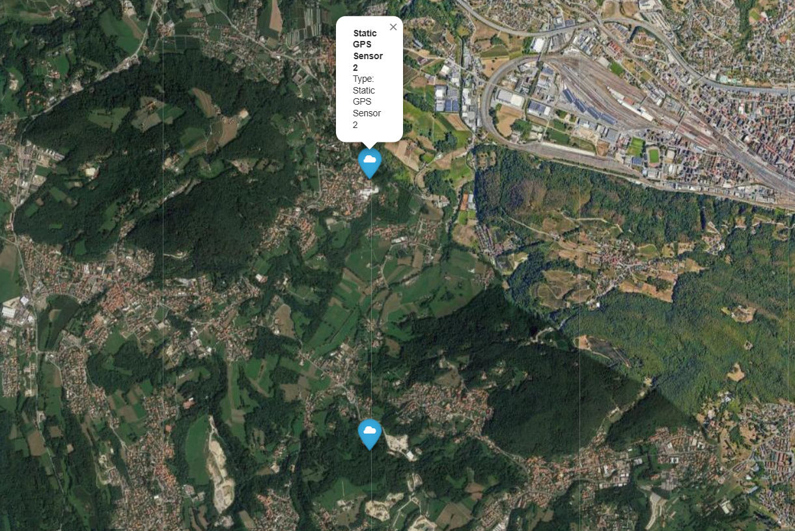

# README

We're currently moving the files from an old project. Please contact <lorenzotettamanti5@gmail.com> before cloning the repository
Currently working on:

- moving and testing all the models
- creating examples
- writing documentation

# CortexBrain

Copyright (c) 2024

- Author: Tettamanti Lorenzo,Lorenzo Bradanini
- Contact: <lorenzotettamanti5@gmail.com>/<lorenzolollobrada@gmail.com>


## What is CortexBrain?

CortexBrain is a data simulation framework developed by CortexFlow, designed to simplify the simulation of IoT devices. Our goal is to model various IoT sensor properties, including smart lights, accelerometers, gyroscopes, and temperature sensors. With CortexBrain, you can simulate IoT sensors, place them on a geolocalized map, monitor key metrics, and simulate specific scenarios.

# Features

CortexBrain provides a range of powerful features, including:

- **IoT Sensor Simulation**: Simulate a variety of IoT sensors, such as temperature, humidity, and light sensors.
- **Geolocalized Map**: Position simulated sensors on a geolocalized map.
- **Scenario Simulation**: Create and test various scenarios with simulated sensors.

# Getting Started

To get started with CortexBrain, follow these steps:

1. **Clone the Repository**: First, clone the repository to your local machine.

   ```bash
   git clone https://github.com/CortexFlow/CortexBrain.git
    ```

2. **Install required packages**:

   ```bash
   cd CortexBrain
   pip install -r requirements.txt

3. **Test Library**:

   ```bash
   python .\testLib.py

4. **Create a simple program**:

   ```bash
   import os
   import sys
   sys.path.append(os.path.abspath(os.path.join(os.path.dirname(__file__), '../')))

   from SyntheticDatas.Sensors.sensorModel import GPS_Sensor
   from SyntheticDatas.Sensors.sensorModel import Map

   if __name__=="__main__":
      #create the sensors using the constructors
      gps_sensor_1 = GPS_Sensor(initial_position=[0, 0], label="Static GPS Sensor ")
      gps_sensor_2 = GPS_Sensor(initial_position=[0, 0], label="Static GPS Sensor 2")
      
      #set the positions
      gps_sensor_1.SetPosition((45.812460, 8.986586))
      gps_sensor_2.SetPosition((45.832460, 8.986586))
      
      #create the map
      map=Map()
      #add the sensors on the map
      map.AddSensor(gps_sensor_1)
      map.AddSensor(gps_sensor_2)
      #create the sensor_map.html file
      map.CreateMap()

Open [sensor_map_tutorial.html](./Examples//sensor_map_tutorial.html) and check the sensors on the map


Check all the examples in the [Examples](./Examples/) folder
Explore all the features in the [documentation](doc.md).

# Roadmap


# Documentation

For a comprehensive guide on getting started and making the most of CortexBrain, visit the [official documentation](doc.md). The documentation includes:

- **Getting Started**: Instructions on how to install and set up CortexBrain.
- **Examples**: Practical examples to help you understand and use the main features.
- **API Reference**: Information on the available APIs and their usage (coming soon).

# Future Developments

At CortexFlow, we're continually working to expand the capabilities of CortexBrain. Our current focus includes:

- **Enhanced Scenario Simulation**: We're improving the scenario simulation engine to support more complex and dynamic environments.
- **Real-time Data Integration**: Future updates will allow CortexBrain to integrate real-time data streams, making the simulations even more accurate and responsive.
- **API Expansion**: We're actively working on extending our API to give developers more flexibility and control over their simulations.

To stay updated on our progress and view what we're currently working on, check out our [Trello board](https://trello.com/invite/b/66c731aab6030598aef7aed3/ATTIdfd7d08e42dca6f8b56a8b26f499ab8c95EB547E/cortexbrain).

# Contributing

We welcome contributions from the community! To contribute to the project, please follow these steps:

1. Fork the repository.
2. Create a new branch for your feature (`git checkout -b feature/feature-name`).
3. Submit a Pull Request with a detailed explanation of your changes.

